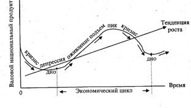

# Перечень вопросов для подготовки к зачёту.

1. [Экономическая теория: предмет и функции.](#1)
2. [Методы исследования экономических явлений. Экономические законы и категории.](#2)
3. [Экономический выбор, альтернативные издержки.](#3)
4. [Рынок: сущность, функции. Провалы рынка.](#4)
5. [Экономическая система: сущность, основные элементы. Типы экономических систем и их основные черты.](#5)
6. [Собственность: сущность и многообразие форм.](#6)
7. [Конкуренция: сущность, виды, формы. Методы конкурентной борьбы.](#7)
8. [Поведение фирмы в условиях совершенной конкуренции.](#8)
9. [Поведение фирмы в условиях чистой монополии.](#9)
10. [Модели несовершенной конкуренции: монополия, олигополия, монополистическая конкуренция.](#10)
11. [Прибыль предприятия: сущность, функции, виды, факторы и условия максимизации.](#11)
12. [Предпринимательство: сущность, черты, виды. Мотивация поведения фирмы.](#12)
13. [Издержки производства и прибыль: экономический и бухгалтерский подходы.](#13)
14. [Производство в краткосрочном периоде: валовой, средний и предельный продукт. Закон убывающей отдачи.](#14)
15. [Кругооборот и оборот капитала. Основной и оборотный капитал. Износ основного капитала. Амортизация.](#15)
16. [Рынок труда и проблема занятости. Государственная политика занятости.](#16)
17. [Рынок земли. Экономическая рента.](#17)
18. [Национальная экономика. Основные макроэкономические показатели: ВНП, ВВП, ЧНП, НД.](#18)
19. [Совокупный спрос и совокупное предложение. Факторы, влияющие на совокупный спрос и совокупное предложение.](#19)
20. [Экономический цикл: сущность, структура и виды колебаний.](#20)
21. [Экономический рост: сущность, факторы, модели, измерение.](#21)
22. [Инфляция: причины, сущность, виды, измерение.](#22)
23. [Безработица: причины, сущность, формы, уровень, последствия. Закон Оукена.](#23)
24. [Деньги: сущность, формы, функции. Предложение и спрос на деньги. Денежные агрегаты.](#24)
25. [Кредит: сущность, источники, формы и принципы функционирования.](#25)
26. [Банки: сущность, виды, роль в функционировании рыночной экономики.](#26)
27. [Финансы: понятие, принципы построения. Государственные, местные финансы, финансы предприятий.](#27)
28. [Государственный бюджет: доходы и расходы.](#28)
29. [Бюджетный дефицит, государственный долг и их социально- экономические последствия.](#29)
30. [Денежно-кредитное регулирование.](#30)
31. [Рынок ценных бумаг: инструменты и государственное регулирование.](#31)
32. [Налоговая система: сущность, функции, структура.](#32)

---

 [⇪⇪⇪](#0)

## 1. Экономическая теория: предмет и функции.

**Экономическая теория** (Экономика) - это наука о выборе наиболее эффективных способов удовлетворения безграничных потребностей людей путем рационального использования ограниченных ресурсов.

Таким образом **предметом экономической теории** является противоречие между ограниченным характером ресурсов и неограниченностью человеческих потребностей.

Функции экономической теории:

1. **Теоретическая** (познавательная) - она объясняет как функционирует экономика, в чем суть, причины, последствия тех или иных экономических явлений, раскрывает законов функционирования экономики.
2. **Практическая** (прагматическая) - применение теории в хозяйственной практике, создание основы для экономической политики государства. На основе теоретических обобщений реальных фактов экономика объясняет, что есть и что может быть, формулирует принципы экономического поведения. Это позитивная экономика.
3. **Прогностическая** - разработка научных прогнозов развития экономики. На основе позитивных знаний экономика дает рекомендации, предлагает рецепты действий. Она объясняет, что должно быть, какой должна быть экономика - нормативная экономика.
4. **Мировоззренческая** - формирование определенной системы взглядов на экономическую жизнь общества.
5. **Методологическая** - разработка методов, приемов и научного инструментария для прикладных экономических наук.

Экономическая теория формулирует ряд основополагающих экономических целей, среди которых - экономический рост, полная занятость, экономическая стабильность, эффективность, социально справедливое распределение доходов и другие. Как общий итог всему - рост богатства общества и благосостояния его членов.

Предметом экономической теории являются экономические отношения в обществе. Поскольку экономические отношения представляют в обществе целостную систему, то предмет экономической теории имеет и другое определение: экономическая теория - это наука о системах экономических отношений в обществе. Экономика - общественная наука. Она изучает определенную сторону жизни общества, поэтому тесно связана с другими общественными науками: историей, социологией, юриспруденцией и т.д.

Проблемы благосостояния и экономических отношений в рыночной экономике изучаются на трех уровнях. Микроуровень - изучение отдельных экономических единиц или частных сегментов экономики; макроуровень - изучение национальной экономики в целом или ее крупных агрегатов и мегоэкономический уровень - изучение мировой экономики в целом, проблем интернациональных экономических связей и отношений.

Исследуя экономику общества, экономическая теория открывает и формулирует научные понятия - категории, принципы, законы, строит графики и модели, отражающие экономические процессы, поведение экономических субъектов.

--- 

 [⇪⇪⇪](#0)

## 2. Методы исследования экономических явлений. Экономические законы и категории.

### Методы исследования экономических явлений.

Основной **метод** исследования, используемый экономической теорией - моделирование экономических явлений и процессов.

Методов исследования экономической теории:

* **Метод научной абстракции**
  Отвлечение в процессе познания от внешних явлений, не экономических сторон, выделение более глубокой сущности предмета или экономического явления

* **Метод функционального анализа**
  Используется зависимость функция-аргумент для проведения экономического анализа и выведения заключений

* **Метод графических изображений**
  Этот метод позволяет оценить соотношение между различными экономическими показателями, их поведение под влиянием изучаемой экономической ситуации

* **Метод сравнительного анализа**
  Сопоставление частных и обобщающих показателей с целью выявления наилучшего результата

* **Метод Экономико-математического моделирования**
  Описание экономических явлений на формализованном языке с помощью математических символов и алгоритмов

* **Индуктивный и дедуктивный методы**
  Индуктивный метод - выведение положений, теорий и выводов из фактов - от фактов к теории. При использовании дедуктивного метода экономисты опираются на случайный наблюдения, логику и интуицию, на основе основе которых формируется предварительная гипотеза. Дедукция и индукции представляют собой взаимодополняющие методы исследования.

* **Метод позитивного и нормативного анализа**
  Позитивный метод исследует фактическое состояние экономики; нормативный метод определяет конкретные условия и экономические аспекты, которые желательны, либо нежелательны в обществе

* **Практические мероприятия**
  Проведение практических мероприятий с целью подтверждения выдвинутой экономической гипотезы

### Экономические законы и категории.

#### Экономические законы

Если в результате экономического анализа удалось обнаружить прочные причинно-следственные связи, то появляется основание говорить о наличии закономерности, т.е. о подчиненности происходящих процессов действию экономических законов. Под экономическим законом понимается устойчивая, повторяющаяся причинно-следственная связь между экономическими процессами, проявляющаяся как объективная необходимость. 

**Экономические законы** - это законы развития производственных отношений (или отношений собственности) в их взаимосвязи с развитием производительных сил. 

Экономические законы, как и законы природы, имеют объективный характер. Однако они существенно отличаются от законов природы, т.к. возникают, развиваются и действуют лишь в процессе экономической деятельности людей - в производстве, распределении, обмене и потреблении. Кроме того, в отличие от законов природы, экономические законы не вечны.

Система экономических законов включает четыре их типа.

1. Это **общие** экономические законы, т.е. законы, присущие всем общественным способам производства (закон роста производительности труда, закон экономии времени и т.д.)

2. **Особые** - законы, которые действуют в нескольких общественно-экономических формациях ( закон стоимости, закон спроса и предложения).

3. **Специфические** экономические законы, которые действуют с условиях одного общественного способа производства. Важнейший из них - основной экономический закон, который выражает связи в процессе взаимодействия между производительными силами и отношениями собственности.  

#### Экономические категории.

**Экономические категории** - это теоретические выражения, мысленные формы производственных отношений, экономических явлений и процессов, которые реально существуют. Это специфические понятия, в которых отражаются экономические признаки предметов, явлений, процессов. 

Они теоретически отображают прежде всего отношения собственности в их взаимодействии с развитием системы производительных сил. Поскольку содержанием последних выступает взаимодействие человека с природой в процессе труда, то одной стороной экономической категории есть отдельные участки этого взаимодействия. Такими категориями, в частности, являются труд, предметы труда, способы труда, потребительская стоимость, продукт труда и т.д. Другой стороной экономической категории есть отношения между людьми по поводу присвоения разных объектов собственности, результатов труда. Отдельные участки этих отношений выражаются в категориях: деньги, цена, стоимость, ЗП, прибыль, рента и т.д. 

Кроме того, каждый закон группирует вокруг себя определенное количество экономических категорий, Напр., закон стоимости раскрывается с помощью таких категорий, как необходимое рабочее время, рыночная стоимость, цена и т.д.

--- 

 [⇪⇪⇪](#0)

## 3. Экономический выбор, альтернативные издержки.

Множественность экономических целей при ограниченности ресурсов ставит проблему **экономического выбора** - выбора наилучшего из альтернативных вариантов их использования, при котором достигается максимальное удовлетворение потребностей при данных затратах.

Перед каждым человеком, фирмой и обществом в целом возникают проблемы, что, как и для кого производить, т. е. как определить условия и направления использования ограниченных ресурсов. Экономическая наука при этом не только пытается зафиксировать то, что есть, но и разрабатывает наилучшие варианты решения возникших проблем. Возникает проблема рационального ведения хозяйства.

В реальной действительности люди всегда сталкиваются с альтернативными издержками. Производство одного продукта означает отказ от другого. Рациональный человек должен подсчитать не только будущие затраты, но и издержки неиспользованных производственных возможностей, чтобы сделать оптимальный экономический выбор.

Издержки одного блага, выраженные в другом благе, которым пришлось пренебречь (пожертвовать), называются **альтернативными издержками**, издержками неиспользованных возможностей или вмененными издержками.

Кроме этого, необходимо различать альтернативную стоимость и альтернативные затраты.

**Альтернативная стоимость** - это наилучшая упущенная возможность.

**Альтернативная стоимость** - это количество одного продукта, от которого необходимо отказаться,  чтобы получить дополнительное количество другого продукта. Для того, чтобы получить дополнительную единицу необходимого продукта каждый раз приходится отказываться от большего количества другого продукта (**Закон альтернативной стоимости**).

**Альтернативные затраты** - это явные затраты, связанные с производством, плюс альтернативная стоимость (стоимость упущенной возможности).

---

 [⇪⇪⇪](#0)

## 4. Рынок: сущность, функции. Провалы рынка.

### Рынок: сущность, функции.

**Рынок** - это способ взаимодействия производителей и потребителей, основанный на децентрализованном безличностном механизме ценовый сигналов.

**В рыночной экономике действуют три субъекта:**

1. Домохозяйство, функционирующее в потребительской сфере экономики;
2. Бизнес или предпринимательство - это предприятия, функционирующие с целью получения прибыли;
3. Правительство (государство) представлено различными бюджетными организациями, которые реализуют функции государственного регулирования экономики.

Взаимодействие этих субъектов осуществляется через рыночный механизм, который представляет собой спрос и предложение, цены и конкуренцию.

**Условия возникновения рынка:**

1. Общественное разделение труда;
2. Экономическое обособление производителей;
3. Самостоятельность производителя, свободы предпринимательства.

**Функции рынка:**

1. **Информационная.** Через постоянно меняющиеся цены, процентные ставки на кредит рынок дает участникам производства объективную информацию о количестве, качестве и ассортименте товаров и услуг, которые поступают на рынок.

2. **Посредническая.** Экономически обособленные производители в условиях глубокого общественного разделения труда должны найти друг друга и обменяться результатами своей деятельности. Только рынок позволяет сделать это и определить взаимную выгоду отношений.

3. **Ценообразующая.** Поступившие на рынок товары одинакового назначения содержат не одинаковое количество материальных и трудовых затрат. Рынок признает только затраты, которые согласен оплатить покупатель.

4. **Санирующая.** Жесткая конкуренция на рынке очищает общественное производство от экономически неустойчивых, нежизнеспособных хозяйственных единиц. Он оставляет лишь эффективно-предприимчивых, что повышает уровень производства и эффективность отношений между покупателем и продавцом.

**Регулирующая.** Самая важная функция, связана с воздействием рынка на все сферы экономики и прежде всего на производство. Воздействие оказываются рыночным механизмом.

### Провалы рынка.

Когда экономисты говорят о функционировании рынка, то имеют в виду насколько эффективно рынок справляется со своей задачей обеспечения организации взаимовыгодной торговли. В идеальном случае рынок должен сделать возможным любой обмен, который является взаимовыгодным для обеих сторон.

**Провал рынка** - это неспособность рынка обеспечить эффективное распределение ограниченных ресурсов.

Из многих возможных причин провала рынка три заслуживают особого внимания: внешние эффекты, общественные блага и недостаточная конкуренция.

**Внешние эффекты.** Одним из типов провала рынка является неспособность рынка обеспечить передачу информации о редкости в форме цен. Для того, чтобы рынки эффективно функционировали, цены должны отражать альтернативную стоимость производства тех или иных товаров и услуг. Производители товара и услуги в нормальной ситуации должны получить цену, по крайней мере равную альтернативной стоимости; в противном случае они просто не захотят осуществлять предложение этого товара на рынке. Однако возникают ситуации, при которых действие производителей (и потребителей) оказывают воздействие на третьих лиц, то есть на людей, не являющихся в данной сделке ни продавцами ни покупателями. Эти эффекты, направленные на третьих лиц и никак не отражающиеся в ценах, известны под названием внешние эффекты. Классическим примером внешнего эффекта является загрязнение окружающей среды.

**Общественные блага.** Товары, не обладающие свойствами исключения и соперничества, называют общественными благами. Наверное, в самом чистом виде примером общественных благ является национальная оборона. Нельзя защитить от ядерной атаки или вторжения одного человека , не распространив эту защиту на всех Кроме того, затраты на защиту одного жителя какой-то зоны не больше, чем оборона целого города или района. Хотя в чистом виде общественные блага встречаются редко, целый ряд благ может характеризоваться частичным отсутствием свойств исключения или соперничества: услуги милиции, уход за городскими улицами, космическая программа и т.д.

**Недостаточная конкуренция.** Третьим источником провала рынка является недостаточная конкуренция. Рыночные цены, если они эффективно регулируют распределение ресурсов, должны отражать альтернативные стоимости. В случае, когда проявляются пагубные внешние эффекты, провал рынка происходит из-за того, что цены падают ниже альтернативных стоимостей. В тех же случаях, когда имеет место недостаточная конкуренция, провал рынка может произойти из-за того, что цены слишком высоки. В качестве примера следует рассмотреть рынок, на котором действует всего один продавец какого-то товара или услуги; такой рынок называется монополией. Если будет установлена слишком высокая цена (напр. На электричество), то потребители получат ложный сигнал об альтернативной стоимости электричества и могут осуществить экономически необоснованные замены электроэнергии, напр. На нефть, газ.

Провал рынка, который обязан своим происхождением недостаточной конкуренции, не обязательно исчерпывается такой экстремальной ситуацией как монополия. При известных обстоятельствах конкуренция между небольшим числом фирм может также привести к ценам, превосходящим альтернативные стоимости, особенно в тех случаях, когда фирмы ограничивают конкуренцию.

**Другие разновидности провалов рынка.** Источниками провалов рынка являются инфляция и циклическая безработица, т.к. экономика, подверженная чрезмерной инфляции и безработице, создает неблагоприятную экономическую среду для координации действий продавцов и покупателей отдельных товаров и факторов производства.

---

 [⇪⇪⇪](#0)

## 5. Экономическая система: сущность, основные элементы. Типы экономических систем и их основные черты.

### Экономическая система: сущность, основные элементы.

**Экономическая система** - это совокупность взаимосвязанных и соответствующим образом упорядоченных элементов хозяйства, которые образуют определенную целостность, экономическую структуру общества, преследующую общую цель.

Важной характеристикой экономической системы является определение ее структурных элементов. Экономическая система в марксистской интерпретации состоит из трех основных звеньев: производительных сил, экономических отношений и механизма хозяйствования.

**Производительные силы** - это совокупность средств производства, работников с их физическими и умственными способностями, науки, технологий, информации, методов организации и управления производством, которые обеспечивают создание материальных и духовных благ, необходимых для удовлетворения нужд людей.

Производительные силы представляют собой материально-вещественное содержание экономической системы, являются важнейшим показателем и критерием достигнутого ею уровня научно-технического прогресса и производительности общественного труда.

**Экономические отношения** - это отношения между людьми по поводу производства, распределения, обмена и потребления материальных и нематериальных благ.

**Система экономических отношений** состоит из: технико-экономических, организационно-экономических социально-экономических отношений.

**Технико-экономические отношения** - это отношения между людьми по поводу создания и использования ими орудий и предметов труда в процессе производства, с помощью которых они воздействуют на силы природы и производят необходимые жизненные блага. Технико-экономические отношения выражают технологию и материально-вещественное содержание общественного производства.

**Организационно-экономические отношения** - это отношения между людьми по поводу применения способов и методов организации и управления общественным производством: отношения обмена деятельностью между людьми, специализации труда, кооперирования, концентрации и комбинирования производства.

**Социально-экономические отношения** - это прежде всего отношения собственности в экономическом значении этого понятия. Отношения собственности определяют главное в экономической системе - способ соединения работника со средствами производства. Кроме того, отношения собственности предопределяют историческую специфику экономической системы, ее социальную структуру, систему власти.

Таким образом, социально-экономические отношения, основой которых являются отношения собственности, занимают определяющее место в структуре производственных отношений и в экономической системе в целом, выполняя в ней системообразующую функцию.

**Хозяйственный механизм** является структурным элементом экономической системы, который состоит из совокупности форм и методов регулирования экономических процессов и общественных действий хозяйствующих субъектов, на основе использования экономических законов рынка, государственных экономических рычагов, правовых норм и институциональных образований.

Важнейшая функция хозяйственного механизма - обеспечение процесса воспроизводства на основе динамического равновесия между производством и потреблением, спросом и предложением.

### Типы экономических систем и их основные черты.

Экономическая система - способ организации хозяйственной жизни общества, другими словами - это способ принятия решений о том, ЧТО? КАК? и ДЛЯ КОГО? производить.

**Типы экономических систем.**

**Традиционная.**

Традиции, передающиеся из поколения в поколение, определяют, какие товары и услуги как и для кого производить

Черты:

* Отсталая технология производства
* Преобладание ручного труда
* Многоукладность экономики
* Консерватизм и неприятие ново­введений

**Командная (плановая).**

Экономические решения прини­мают в основном представители государственной власти

Черты:

* Отсутствие у производителей свободы выбора
* Отсутствие у производителей заинтересованности в повы­шении эффективности произ­водства

Достоинства:

* Возможность концентра­ции усилий и ресурсов на отдельных направлениях экономической деятель­ности
* Обеспечение экономи­ческой и социальной стабильности, так назы­ваемая "уверенность в за­втрашнем дне"

Недостатки:

* Невозможность быстрого раз­вития и внедрения достижений научно-технического прогресса 
* Отсутствие свободы производ­ства и потребления 
* Низкий уровень удовлетворе­ния потребностей 
* Возникновение "черного рынка", хронический дефицит предметов потребления

**Рыночная.**

Свободное решение основных эко­номических вопросов на основе рыночных механизмов регулиро­вания

Черты:

* Преобладание частной собствен­ности
* Экономические субъекты осущест­вляют деятельность в соответствии со своими личными экономически­ми интересами
* Свободная конкуренция
* Минимальное влияние государства

Достоинства:

* Способствует эффективно­му распределению ресур­сов, так как направляет ресурсы в производство тех товаров и услуг, в ко­торых общество больше всего нуждается ("невиди­мая рука рынка") 
* Свобода выбора и деятель­ности предпринимателей 
* Способствует повышению качества товаров и услуг 
* Гибкость, высокая адаптированность к изменяю­щимся условиям 
* Стимулирование научно-технического прогресса

Недостатки:

* Неравное распределение дохо­да; рынок ориентирован на удо­влетворение потребностей тех, кто платит деньги 
* Нестабильность развития, что приводит к инфляции и безра­ботице, социальным противо­речиям
* Недостаточное финансирование научных исследований, сферы образования
* Ослабление конкуренции, про­исходящее вследствие слияния небольших предприятий 
* Расточительное отношение к природным ресурсам

**Смешанная (развитая смешанная экономика).**

Одновременное сочетание част­ного и государственного секто­ров экономики, рынка и государственного регулирования, капиталистических тенденций и социализации жизни

Черты:

* Недостатки рыночной экономи­ки сглаживаются государствен­ным регулированием
* Непосредственное участие госу­дарства в предоставлении соци­альных благ

Достоинства:

* Обеспечение экономиче­ского роста и экономиче­ской стабильности 
* Социальные гарантии 
* Защита и поощрение кон­куренции, борьба с моно­полиями
* Обеспечение политиче­ской стабильности 
* Стимулирование техноло­гических и организацион­ных инноваций 
* Поддержка сферы образо­вания, культуры, науки

Недостатки:

* Отсутствие стандартных схем
* Необходимость разработки национальных моделей с уче­том национальной специфики

---

 [⇪⇪⇪](#0)

## 6. Собственность: сущность и многообразие форм.

**Сущность.**

Выделяют следующее содержание собственности:

* экономическое;
* юридическое.

**Экономическая сущность собственности** построена на отношениях между субъектом - собственником и объектом - собственностью. Как правило, собственностью является имущество, от которого зависит производственный процесс - экономические ресурсы, факторы производства.

**Собственность** - исторически развивающиеся общественные отношения по поводу распределения (присвоения), описывающие принадлежность субъекту, у которого имеется исключительное право на распоряжение, владение и пользование объектом собственности.

Система экономических отношений собственности включает следующие элементы:

1. **Присвоение собственности.** Это экономический процесс, в результате которого определенный человек приобретает исключительное право на пользование определенной вещью или благом.

2. **Использование собственности для хозяйственной деятельности.** Оно может быть осуществлено непосредственно собственником либо передано другому хозяйствующему субъекту.

3. **Передача собственности.** Она может быть осуществлена насильственно (кража, отъем, национализация) либо добровольно (продажа, передача в аренду).

Экономические отношения, связанные с собственностью, влияют на сущность и характер всего производственного процесса в экономике. По этому поводу люди могут вступать между собой в конфликт, а поэтому собственность не может быть только экономической категорией. Она должны быть урегулирована правовыми нормами - системой общепринятых правил владения и распоряжения собственностью.

**Юридическая сущность собственности** предполагает общепринятые на законодательном уровне правила регулирования собственности.

**Собственность** - это наиболее полный комплекс прав, которым может обладать субъект права в отношении своего имущества. В ряде теорий признаётся также собственность на некоторые права. Конституция РФ и Гражданский кодекс РФ признают и гарантируют любые формы собственности, при этом нормативно установлены три формы: государственная (федеральная и субъектов РФ), муниципальная и частная собственность.

Гражданский кодекс РФ выделяет следующие виды субъектов собственности (собственников):

* органы государственного и муниципального управления. В соответствии с этим выделяют государственную и 
* муниципальную собственность;
* юридическое лицо;
* гражданин - физическое лицо.

**Гражданский кодекс РФ выделяет следующие виды объектов собственности (собственность):**

* интеллектуальную собственность;
* движимое имущество (например, ценные бумаги, ассигнации, деньги, драгоценные металлы);
* недвижимое имущество (например, земля, промышленные и жилые здания).

**Формы.**

**Частная** собственность - это такая форма собственности, при которой правом владения, пользования и распоряжения, включая передачу или продажу имущества и дохода, обладает отдельный индивид (семья). Здесь собственность выступает в двух видах: трудовая и нетрудовая.

Субъекты трудовой частной собственности - единоличные крестьяне, ремесленники и другие лица, которые живут своим трудом.

Второму виду частной собственности свойственно обогащение за счет чужого труда. Когда основная масса средств производства попадает в руки немногих лиц, это означает отчуждение остальной части общества от этих благ. Тогда возникают имущественное неравенство и поляризация общества.

**Государственная** собственность - это такая система отношений, при которой управление и распоряжение объектами собственности осуществляют представители государственной власти. Государственная собственность существует на уровне всего народного хозяйства (федеральная собственность); на уровне края, области (коммунальная собственность); на уровне района, города, села (муниципальная собственность).

**Коллективная** собственность - это такая система экономических отношений, при которой трудовой коллектив совместно владеет, пользуется и распоряжается средствами и продуктами производства. Формами коллективной собственности в России в настоящее время являются кооперативная, акционерная, собственность трудовых коллективов, общественных организаций и т. п.

---

 [⇪⇪⇪](#0)

## 7. Конкуренция: сущность, виды, формы. Методы конкурентной борьбы.

### Конкуренция: сущность, виды, формы.

**Конкуренция** - это борьба между товаропроизводителями, между поставщиками товаров (продавцами) за лидерство,за первенство на рынке, за "кошелек" потребителя. Конкуренция предполагает борьбу товаропроизводителей и поставщиков за наиболее выгодные условия производства, сферы приложения капитала, источники сырья, рынки сбыта.Конкуренция является "невидимой рукой", которая регулирует все общественное хозяйство. 

Конкуренция служит одним из важнейших способов повышения эффективности, как целой экономической системы, так и всех ее звеньев. Рассматривая конкуренцию необходимо показать ее как положительные стороны, так и отрицательные.

**Положительные стороны конкуренции:**

1. конкуренция требует совершенствовать технику и технологии;
2. конкуренция стимулирует повышение качества товара;
3. конкуренция заставляет снижать затраты (и цены);
4. конкуренция повышает качество продукции (клиент всегда прав). 

**Отрицательные стороны конкуренции:** 

1. при конкуренции наблюдается беспощадность и жестокость по отношению к неудачнику;
2. многочисленность "жертв" в виде банкротства и безработицы. 

Говоря о конкуренции необходимо показать ее виды. Существует шесть видов конкуренции:

1. **функциональная конкуренция** - базируется на том, что одну и туже потребность потребителя можно удовлетворить по-разному;
2. **видовая конкуренция** - это конкуренция между аналогичными товарами, но разными по оформлению;
3. **предметная конкуренция** - это конкуренция между аналогичными товарами, но разными по качеству изделия и по притягательности марки;
4. **ценовая конкуренция** - снижение цены увеличивает продажи, приводит к расширению рынка;
5. **скрытая ценовая конкуренция.** Бывает двух видов:
    * продажа личного товара по цене конкурента.
    * снижение цены потребления товара6. 
    * незаконные методы: антиреклама товаров конкурентов; производство товаров имитаторов (подделка).

Различают три формы конкуренции:
1. функциональную;
2. видовую (личностную);
3. предметную.

**Функциональная конкуренция** - возникает потому, что любую потребность можно удовлетворить различными способами. Все товары, обеспечивающие такое удовлетворение, являются функциональными конкурентами. Функциональную конкуренцию приходится учитывать, даже если фирма является производителем поистине уникального товара. 

**Видовая** (личностная) конкуренция - т. е. имеются товары, предназначенные для одной и той же цели, но различающиеся каким-то важным параметром (легковые 5-и местные автомобили одного класса, но с разными по мощности двигателями). 

**Предметная конкуренция** - результат того, что фирмы выпускают, по сути, идентичные товары, различающиеся лишь качеством изготовления или даже одинаковые по качеству. Такая конкуренция иногда называется межфирменной.

### Методы конкурентной борьбы.

1. **Ценовая конкуренция.** Ценовые методы характеризуются тем, что в конкурентной борьбе за потребителя и завоевание рынка главным образом используется такой прием как снижение цен. Предприниматель, принявший такое решение, полагает, что более низкой ценой на свои товары ему удастся победить (разорить) конкурентов. Захватив господствующее положение на рынке, последующим ростом цен предприниматель стремится восполнить временные потери прибыли.

**При прямой ценовой конкуренции** фирмы широко оповещают о снижении цен на выпускаемые на рынке товары. **При скрытой ценовой конкуренции** фирмы вводят новый товар с улучшенными потребительскими свойствами, а цену поднимают непропорционально мало.

2. **Неценовая конкуренция.** Выдвигает на первый план более высокую, чем у соперников, надежность, меньшую "цену потребления", более современный дизайн и т. д. Сильнейшее орудие неценовой конкуренции - реклама. К числу неценовых методов относят также предоставление большого комплекса услуг (в том числе обучение персонала), зачет старого сданного товара в качестве первого взноса за новый, поставку оборудования уже не "под ключ", а на условиях "готовая продукция в руки".

3. К незаконным методам неценовой конкуренции относятся:
    * промышленный шпионаж;
    * переманивание специалистов, владеющих производственными секретами;
    * выпуск товаров, внешне ничем не отличающихся от изделий-подлинников, но существенно худших по качеству.

--- 

 [⇪⇪⇪](#0)

## 8. Поведение фирмы в условиях совершенной конкуренции.

**Совершенная конкуренция** - абстрактный, идеальный тип рыночной структуры, служащий эталоном для сравнения с другими типами рынков, характеризующийся приспособлением продавцов и покупателей к равновесному состоянию рыночных условий. При таком типе организации рынка исключены все виды соперничества, как между продавцами, так и между покупателями.

Для совершенной конкуренции характерны следующие признаки:

* множество продавцов и покупателей, каждый из которых удовлетворяет малую долю рыночного спроса;
* однородность продукции (продукты идентичны и взаимозаменяемы);
* свободные вход на рынок и выход с рынка;
* совершенная информированность продавцов и покупателей о состоянии рынка;
* независимость рыночных цен от действий продавцов и покупателей.

Преследуя цель максимизации прибыли, фирма, действующая в условиях совершенной конкуренции должна выбрать такой объем поставляемой продукции, чтобы достичь наибольшей прибыли за каждый период продаж.

**Прибыль П** - это разница между валовым доходом **TR** и совокупными издержками производства **ТС** за период продаж:

**
П = TR - ТС
**

Валовой доход определяется как произведение цены проданного товара **Р** и объема продаж **Q**:

**
TR = P * Q
**

Заметим, что увеличение валового дохода при совершенной конкуренции возможно лишь посредством изменения объема продаж.

**Совокупные издержки** - это издержки всех факторов производства, использованных фирмой при производстве продукции. Они складываются из постоянных и переменных издержек:

**
ТС = ТFC + TVC
**

Постоянные издержки **ТFC** представляют собой сумму затрат, не зависящих от изменения объема производства. Переменные издержки **TVC**  зависят от объема выпуска продукции.

Функция прибыли может принимать максимальное значение, когда валовой доход **TR** в наибольшей степени превышает совокупные издержки **ТС**. Эта ситуация связана с понятием предельной величины.

Под предельным значением показателя в экономической теории понимают значение производной показателя. Предельный доход **MR** равен производной функции дохода по переменной **Q**:

**
MR = TR'(Q) = P
**

Он выражает изменение валового дохода от продажи дополнительной единицы продукции.

**Предельные издержки** - представляют собой производную функции издержек по переменной **Q**, и выражают дополнительные издержки на производство дополнительной единицы продукции:

**
MC = TC'(Q)
**

**Предельная прибыль** - **производная функции прибыли** -  представляет собой разность между предельным доходом и предельными издержками:

**
MП = MR - МС
**

Необходимым условием максимума прибыли является равенство нулю ее производной:

**
MП = 0
**

Таким образом, прибыль фирмы будет максимальна, если ее предельная прибыль равна нулю, т.е. предельные издержки **МС** равны предельному доходу **MR**:

**
МС = MR = Р
**

Объем оптимального выпуска Q0 определяется условием равенства рыночной цены предельным издержкам и предельному доходу.

---

 [⇪⇪⇪](#0)

## 9. Поведение фирмы в условиях чистой монополии.

**Чистая монополия** - это ситуация, когда существует единственный продавец товара, причем этому товару нет близкого заменителя в других отраслях.

В условиях чистой монополии:

1. отрасль состоит из одной фирмы; 
2. Полный контроль над ценой; 
3. Отсутствуют реальные альтернативы, нет близких заменителей(субститутов); 
4. Барьеры для вступления в отрасль трудно преодолимые.

Зная кривую спроса, монополист может определить, какая комбинация объема выпуска и цены обеспечит ему максимальную прибыль. Монополист не может назначить какую угодно цену на свой товар. Каждому уровню цены на рынке соответствует определенное количество продукта, которое потребители готовы купить в данное время. Поэтому монополист не так всесилен, как это иногда представляется. Если он назначает объем выпуска, кривая спроса подскажет ему предельную цену, которую примет потребитель. Если монополист назначает цену, он должен ограничить предложение тем объемом, которое ему диктует потребительский спрос. Поэтому в условиях монополии фирма должна принять одновременное решение по объему выпуска и цене, т.е. выбрать некоторую их комбинацию, исходя из особенностей кривой спроса.

--- 

 [⇪⇪⇪](#0)

## 10. Модели несовершенной конкуренции: монополия, олигополия, монополистическая конкуренция.

**Несовершенная конкуренция** - конкуренция в условиях, когда отдельные производители имеют возможность контролировать цены на продукцию, которую они производят.

В отличие от модели рынка совершенной конкуренции, которая является абстракцией и практически не существует в реальной жизни, а только в теории, рынок несовершенной конкуренции встречается практически повсеместно. Большинство реальных рынков в современной экономике - это рынки несовершенной конкуренции.

Признаки несовершенной конкуренции:

* наличие входных барьеров в отрасль;
* дифференцированность продукции;
* основная доля продаж приходится на одного или нескольких производителей-лидеров;
* возможность контролировать полностью или частично цену на свою продукцию.

В условиях несовершенной конкуренции равновесие фирмы (т.е. когда **MC = MR**) наступит тогда, когда средние издержки не достигнут своего минимального уровня, а цена будет выше средних издержек:

**
(MC = MR) < AC < P
**

Существуют такие виды несовершенной конкуренции как монополия, олигополия и монополистическая конкуренция.

**Виды рыночных структур несовершенной конкуренции.**

Виды рынков несовершенной конкуренции |	Количество производителей | Степень дифференциации продукции | Степень контроля над ценами |	Барьеры для входа на рынок
-|-|-|-|-
Монополистическая конкуренция |	Большое количество фирм	| Разнообразная продукция |	Относительно небольшая	| Низкие
Олигополия |	Малое количество фирм |	Однообразная продукция или с незначительными различиями	| Частичная |	Высокие
Монополия |	Одна фирма | Однообразная продукция не имеющая субститутов | Полная | Высокие

**Монополией** называется ситуация в отрасли, при которой 

1. в отрасли существует только одна фирма, 
2. благо, которое она производит, не имеет близких заменителей,
3. отсутствует возможность появления в отрасли других фирм.

Такая фирма, не имеющая "соседей" по отрасли, является полным хозяином положения на рынке своего блага. Выпуск этой фирмы является выпуском всей отрасли, и предложение этой фирмы является предложением всей отрасли.

Таким образом, монополист (так называют фирму, не имеющую конкурентов) обладает уникальной возможностью выбирать, сколько будет производить вся отрасль.

Более того, единственная фирма на рынке может выбирать цену блага. Монополист не должен принимать решения в условиях заданной цены (в отличие от фирмы, действующей в условиях конкуренции). Для него задана рыночная кривая спроса на его продукцию, положение которой определяется не зависящими от него обстоятельствами (предпочтениями и доходами потребителей).

Таким образом, монополист выбирает и цену своего продукта, и объем его предложения.

**Олигополия** - это тип рынка несовершенной конкуренции, характеризующимся действием на рынке нескольких продавцов, а появление новых затруднено или невозможно.

Если на рынке действуют два производителя, то такой тип рынка называется **дуополией**, которая является частным случаем олигополии, встречающейся чаще в теоретических моделях, чем в реальной жизни.

Олигополистические рынки обладают следующими признаками:

* малое число фирм и большое число покупателей. Это означает, что объем рыночного предложения находится в руках нескольких крупных фирм, которые реализуют продукт многим мелким покупателям;

* дифференцированная или стандартизированная продукция. В теории удобнее рассматривать однородную олигополию, однако если отрасль производит дифференцированную продукцию и имеется множество субститутов, то это множество субститутов можно анализировать как однородный агрегированный продукт;

* наличие существенных препятствий входа на рынок, т.е. высокие барьеры входа на рынок;

* фирмы в отрасли сознают свою взаимозависимость, поэтому контроль за ценами ограничен.

**Монополистическая конкуренция** - тип структуры рынка, состоящий из множества мелких фирм, выпускающих дифференцированную продукцию, и характеризующийся свободным входом на рынок и выходом с рынка. Продукция этих фирм является близкой, но не полностью взаимозаменяемой, т.е. каждая из множества мелких фирм производит продукт, несколько отличающийся от продукции ее конкурентов.

Посредством дифференциации продукта монополистический конкурент уменьшает эластичность спроса по цене. Повышая цену, монополистический конкурент не лишается всех потребителей, как это бывает в условиях совершенной конкуренции. Рынок несколько сузится, но останутся те, кто устойчиво предпочитает продукцию только данного производителя.

Основные черты монополистической конкуренции:

* наличие множества продавцов и покупателей (рынок состоит из большого числа независимых фирм и покупателей);
* свободный вход на рынок и выход с него (отсутствие барьеров, удерживающих новые фирмы от вступления на рынок, или препятствий на пути существующих фирм, покидающих рынок);
* разнородная, дифференцированная продукция, предлагаемая конкурирующими фирмами. Причем продукты могут отличаться один от другого по одному или ряду свойств (например по химическому составу);
* совершенная информированность продавцов и покупателей об условиях рынка;
* влияние на уровень цен, но в довольно узких рамках.

---

 [⇪⇪⇪](#0)

## 11. Прибыль предприятия: сущность, функции, виды, факторы и условия максимизации.

**Прибыль** - это важнейший показатель финансовых результатов хозяйственной деятельности предприятия. Она понимается как превышение доходов от продажи товаров и услуг над затратами на производство и продажу этих товаров.

Исчисляется прибыль как разность между валовым доходом **TR** и общими или валовыми издержками **TC**. 
**
TR=P×Q
**

где: **TR** - валовой доход;
**P** - цена реализации единицы продукции;
**Q** - объём реализованной продукции.

**
Прибыль = TR - TC
**

**AR = TR / Q** - средний доход.

Для оценки работы предприятия используется также категория предельный доход. Это изменение в валовом доходе, получаемое при продаже дополнительной единицы продукции.

**
MR = ΔTR / ΔQ
**

Для конкурентного предприятия MR = P.

В хозяйственной практике очень часто в валовом доходе, помимо валовой выручки от реализации продукции, учитываются внереализационные доходы, получение которых не связано с непосредственной производственной деятельностью предприятия. Они включают в себя:

* доходы по ценным бумагам, принадлежащим предприятию;
* доходы от сдачи имущества в аренду;
* полученные штрафы, пени, неустойки.

**Функции прибыли**

1. **Основная функция** прибыли состоит в том, что она характеризует конечные финансовые результаты предприятия или фирмы.
2. **Распределительная функция** - создание фондов денежных средств, обеспечивающих финансирование деятельности предприятия.
3. **Стимулирующая функция** - снижение издержек производства, внедрение инноваций и современных технологий.
4. **Социальная функция** - формирование фонда социального развития и материального стимулирования работников.

**Виды прибыли**

1. **Бухгалтерская прибыль** - это разность между валовым доходом и явными (внешними) издержками.
2. **Экономическая прибыль** - это разность между валовым доходом и явными (внешними) и неявными (внутренними) издержками. При это в неявные издержки включаются и доход предпринимателя. Экономическая прибыль показывает н насколько эффективно на данном предприятии используются производственные ресурсы.
3. **Нормальная прибыль** - это вознаграждение за выполнение предпринимательских функций. Ее уровень оценивается как прибыль на вложенный капитал при его простейшем (обычном) использовании, например, сдача помещения в аренду.
4. **Балансовая прибыль** - разность между валовым доходом, с одной стороны, и материальными затратами, амортизацией и заработной платой, с другой стороны. Её также общей называют общей прибылью.
5. **Предельная прибыль** - разность между предельным доходом MR и предельными издержками MC. Предельная прибыль, как и предельный доход, является положительной величиной до определённого уровня производства продукции.
6. **Чистая прибыль** - количественно она равняется экономической прибыли.

**Показатели прибыли.**

1. Абсолютный показатель - масса прибыли.
2. Относительные показатели:
    * норма прибыли
    * рентабельность производства
    * рентабельность продукции

Принято считать, что рентабельность продукции от 15% до 50% является приемлемой, а свыше 100% является сверхприбылью. В российской экономике до кризиса 2008 около 40% предприятий были убыточными. В 2006 году рентабельность продукции в российской экономике в среднем составляла 13,2%.

**Максимизация прибыли (минимизация убытков)** достигается при объеме производства, соответствующем точке равновесия предельного дохода и предельных издержек. Эта закономерность называется правилом максимизации прибыли.

Правило максимизации прибыли означает, что предельные продукты всех факторов производства в стоимостном выражении равны их ценам или что каждый ресурс используется до тех пор, пока его предельный продукт в денежном выражении не станет равнозначен его стоимости.

Увеличение выпуска продукции повышает прибыль предприятия. Но только в том случае, если доход от продажи дополнительной единицы продукции превышает издержки производства данной единицы (MR больше MC).

**MR** - предельный доход;
**MC** - предельные издержки

Когда издержки, связанные с выпуском еще одной единицы продукции, выше приносимого за счет ее реализации дохода, то предприятие лишь увеличивает свои убытки. Если MR меньше MC, то производить дополнительный товар невыгодно. На рисунке эти убытки отмечены жирными линиями над точками D, E, F.

В этих условиях максимальная прибыль достигается при том объеме производства (точка О), где кривая предельных издержек в своем возрастании пересечет кривую предельного дохода (MR = MC). Пока MR больше MC, увеличение производства дает возрастающую меньше прибыль. Когда же после пересечения кривых устанавливается соотношение MR MC, к увеличению прибыли ведет сокращение производства. Прибыль растет при приближении к точке равенства предельных издержек и дохода. Максимум прибыли достигается в точке О.

В условиях совершенной конкуренции предельный доход равен цене товара. Поэтому правило максимизации прибыли может быть представлено в другом виде:

**
P = MC
**

В условиях совершенной конкуренции максимизация прибыли (минимизация убытков) достигается при объеме производства, соответствующем точке равенства цены и предельных издержек.

---

 [⇪⇪⇪](#0)

## 12. Предпринимательство: сущность, черты, виды. Мотивация поведения фирмы.

**Предпринимательство** - инициативная самостоятельная деятельность граждан и их объединений, направленная на получение прибыли, осуществляемая на свой риск и под свою имущественную ответственность.

Наемный работник осуществляет физический процесс пользования чужой собственностью (станком, машиной, компьютером) для непосредственного производства благ и услуг. Отличие предпринимателя от наемного работника состоит в том, что ему поручается использование совокупной собственности - фирмы - со всей вытекающей из этого ответственностью.

Субъектом предпринимательства выступает предприниматель. Предприниматель - не обязательно собственник.

Поэтому в качестве предпринимателя выступает собственник, менеджер, или всякий человек, берущийся за организацию бизнеса на свой страх и риск.

Предприниматель призван удовлетворить запросы определенного круга потребителей в конечном продукте, продавая им товар и получая за это денежную выручку.

Рассмотренные характеристики дают возможность выделить важнейшие отличительные **черты** предпринимательства.

Во-первых, это самостоятельность и экономическая свобода деятельности. Любой предприниматель независим в принятии решения по поводу организации собственного дела в любой экономической сфере (естественно, кроме запрещенной законом).

Во-вторых, деятельность предпринимателя связана с риском и неопределенностью успеха начатого дела. Поэтому такая деятельность предъявляет жесткие требования к личным качествам человека, занятого предпринимательством. Здесь важны и грамотность, и знания, и умения, и характер.

В-третьих, важнейшей отличительной чертой предпринимательской деятельности является опора на инновации.

Различают следующие виды предпринимательства:

* производственное,
* коммерческо-торговое,
* финансово-кредитное,
* посредническое,
* страховое.

**Производственное предпринимательство.**

Предпринимательство называется производственным, если сам предприниматель непосредственным образом, используя в качестве факторов орудия и предметы труда, производит продукцию, товары, услуги, работы, информацию, духовные ценности для последующей реализации (продажи) потребителям, покупателям, торговым организациям.

Производственное предпринимательство включает выпуск промышленной и сельскохозяйственной продукции производственно-технического назначения, услуги связи, коммунальные и бытовые услуги, производство информации, знаний, выпуск книг, журналов, газет. В широком смысле слова производственное предпринимательство есть создание любого полезного продукта, необходимого потребителям, обладающего способностью быть проданным или обмененным на другие товары.

**Коммерческое (торговое) предпринимательство.**

Принцип организации торгового предпринимательства несколько отличается от производственного, так как **предприниматель выступает непосредственно в роли коммерсанта, торговца, продавая готовые товары, приобретенные им у других лиц, потребителю (покупателю)**.
Коммерческое предпринимательство привлекает видимой возможностью продать товар по цене намного более высокой, чем он был куплен, и положить тем самым в карман весомую прибыль.

Сфера официального коммерческого предпринимательства - магазины, рынки, биржи, выставки-продажи, аукционы, торговые дома, торговые базы, др. учреждения торговли.

**Для успешного занятия торговым предпринимательством необходимо досконально знать неудовлетворенный спрос потребителей**, быстро реагировать, предлагая соответствующие товары или их аналоги.

**Финансово-кредитное предпринимательство.**

Финансовое предпринимательство - это особая форма коммерческого предпринимательства, в котором в качестве предмета купли-продажи выступают валютные ценности, национальные деньги (российский рубль) и ценные бумаги (акции, облигации и др.), продаваемые предпринимателем покупателю или предоставляемые ему в кредит.

Суть финансовой предпринимательской операции состоит в том, что предприниматель приобретает основной фактор предпринимательства в виде различных денежных средств (денег, иностранной валюты, ценных бумаг) за определенную денежную сумму у обладателя денежных средств. Приобретенные денежные средства продаются затем покупателям за плату, превышающую денежную сумму, затраченную первоначально на покупку этих денежных средств, в результате чего образуется предпринимательская прибыль.

В случае кредитного предпринимательства предприниматель привлекает денежные вклады, выплачивая обладателям вкладов вознаграждение в виде депозитного процента вместе с последующим возвратом вклада. Разница между депозитным и кредитным процентом служит источником прибыли предпринимателей-кредиторов.

**Посредническое предпринимательство**

Посредничеством называют предпринимательство, в котором предприниматель сам не производит и не продает товар, а выступает в роли посредника, связующего гнезда в процессе товарного обмена, в товарно- денежных операциях.

Посредник - это лицо (юридическое или физическое), представляющее интересы производителя или потребителя, но сами таковыми не являющиеся. Посредники могут вести предпринимательскую деятельность самостоятельно или выступать на рынке от имени (по поручению) производителей или потребителей. В качестве посреднических предпринимательских организаций на рынке выступают брокеры, дилеры, биржи, в какой-то мере коммерческие банки и другие кредитные организации.

**Страховое предпринимательство.**

Страховое предпринимательство заключается в том, что предприниматель в соответствии с законодательством и договором гарантирует страхователю возмещение ущерба в результате непредвиденного бедствия потери имущества, ценностей, здоровья, жизни и других видов потерь за определенную плату при заключении договора страхования, Страхование заключается в том, что предприниматель получает страховой взнос, выплачивая страховку только при определенных обстоятельствах. Так как вероятность возникновения таких обстоятельств невелика, то оставшаяся часть взносов образует предпринимательский доход.

---

 [⇪⇪⇪](#0)

## 13. Издержки производства и прибыль: экономический и бухгалтерский подходы.

**Издержки производства (С)** - это затраты на производство продукции. Издержки производства являются одновременно и простой и очень сложной категорией. Простой, потому что само значение слова "издержки" подсказывает, что это то, во что обходится предпринимателю и фирме организация производства, а сложной - потому что существует ряд методологически разных подходов к определению сущности, классификации и величины издержек. Прежде всего, необходимо остановиться на особенностях бухгалтерской и экономической характеристики издержек.

Для производства товара фирма использует как покупные, так и собственные экономические ресурсы.

Денежные средства, которые фирма платит внешним поставщикам, приобретая у них факторы производства, составляют ее фактические, явные или бухгалтерские издержки. Бухгалтер определяет издержки как фактические затраты фирмы на приобретение факторов производства у поставщиков. Они проходят через бухгалтерские документы и этим приобретают явную форму. К ним относят оплату сырья и материалов, оплату транспортных, финансовых, юридических услуг, заработную плату наемным рабочим, налоги и прочие расходы.

С собственными экономическими ресурсами фирмы связаны ее неявные издержки, учет которых принципиально отличает экономический подход от бухгалтерского. Поскольку фирма отказалась от использования собственных факторов производства в альтернативных целях, то ее неявные издержки оцениваются как сумма максимального упущенного дохода от этих факторов производства в наилучшем из исключенных вариантов. Так, если собственник фирмы одновременно является ее управляющим, использует собственный капитал и принадлежащее ему помещение, то к неявным издержкам фирмы можно отнести:

* упущенную заработную плату, которую он мог бы получать в другой фирме в качестве наемного работника;
* упущенный рентный доход, который он мог бы получать, сдавая в аренду собственное помещение;
* упущенный процентный доход на собственный капитал, который он мог бы иметь, положив деньги в банк;
* упущенный предпринимательский доход, то есть прибыль, которую он мог бы получать в любой другой отрасли, организовав там свой бизнес.

Для собственника все издержки - явные и неявные - являются альтернативными, так как существуют альтернативные варианты использования ресурсов, вложенных им в фирму. **Экономические издержки** представляют собой платежи всем собственникам экономических ресурсов, достаточные для того, чтобы отвлечь эти ресурсы от альтернативных вариантов использования.

**
С эк. = С бухг. + С неявн
**

Таким образом, **бухгалтерский подход** отражает традиционное понимание издержек, но он не отражает того важного обстоятельства, что экономические ресурсы редки и ограниченны, а, следовательно, не учитывает необходимость их эффективного использования. **Экономический подход** основан на выявлении того, какой максимальный доход можно было бы получить при альтернативном использовании израсходованных фирмой факторов производства.

Экономический интерес фирмы связан с прибылью, которая определяется как разница между доходом фирмы от продажи продукции и ее совокупными издержками.

В финансовых отчетах фирмы рассчитывается бухгалтерская прибыль, информация о которой необходима собственникам (акционерам), управляющим, инвесторам, налоговым органам, для принятия решений. Прибыль бухгалтерская определяется как разница между валовым доходом и явными издержками фирмы.

Величина экономической прибыли является ориентиром при принятии управленческих решений о целесообразности деятельности фирмы в данной отрасли. **Экономическая прибыль** считается как разница между совокупным доходом и всеми издержками фирмы.

**Нормальная прибыль** - это минимальный доход, необходимый для того, чтобы удержать предпринимателя в данной отрасли. Нормальная прибыль является элементом неявных издержек. Если p эк. = 0, то это означает, что предприниматель получает только нормальную прибыль, которая позволяет удержаться ему в рамках данного направления деятельности.

---

 [⇪⇪⇪](#0)

## 14. Производство в краткосрочном периоде: валовой, средний и предельный продукт. Закон убывающей отдачи.

### Производство в краткосрочном периоде: валовой, средний и предельный продукт.

Под производством понимается процесс использования производственных ресурсов (труда, капитала, земли, информации и предпринимательской способности) для выпуска товаров и предоставления услуг.

В микроэкономике **краткосрочным** периодом называют отрезок времени, в течение которого предприятие может изменить (нарастить или сократить) применение некоторых факторов производства (они называются переменными), но хотя бы один фактор остается неизменным. Как правило, это уровень производственных мощностей. Этот фактор называется постоянным.

Производитель может достаточно легко и быстро изменить количество используемого труда, наняв дополнительных работников или введя сверхурочные часы. Ему, однако, обычно требуется значительно больше времени для увеличения капитала.

В коротком периоде различают валовой, средний и предельный продукт труда.
**Валовой продукт** -  это просто иное название выпуска. **Средний продукт труда** -  это выпуск, деленный на количество используемого труда.

Предельный продукт труда показывает, какое количество дополнительной продукции приносит фирме дополнительный рабочий.

### Закон убывающей отдачи.

В условиях, когда постоянные ресурсы, используемые в производстве, неизменны по количеству, качеству и составу, использование дополнительной единицы переменного ресурса сначала повышает, а с определенного объема производства снижает предельную и среднюю производительность. В этом случае действует закон убывающей отдачи.

Фирма в краткосрочном периоде может влиять только на переменные издержки. В связи с этим менеджеру (предпринимателю) необходимо следить за оптимальным при данной технологии соотношением постоянных и переменных ресурсов, контролируя предельную и среднюю производительность. В этом состоит практическая функция закона убывающей отдачи.

---

 [⇪⇪⇪](#0)

## 15. Кругооборот и оборот капитала. Основной и оборотный капитал. Износ основного капитала. Амортизация.

### Кругооборот и оборот капитала.

Капитал (фонды), выполняя свои функции, находятся в постоянном движении.

Процесс обращения, взятый как однократный акт, называется **кругооборотом фондов**. **Кругооборот** - последовательное превращение фондов из одной формы в другую и возвращение их в исходную форму.

Первая стадия кругооборота происходит на ресурсном рынке. Предприниматель превращает денежную форму капитала в производительную - покупает и оплачивает средства производства (в том числе, если нужно, и землю) и рабочую силу и сводит их воедино для производства товаров (услуг).

Вторая стадия кругооборота происходит в производстве. Здесь факторы производства создают новый товар, а производительная форма фондов превращается в товарную. Стоимость этих товаров больше стоимости потреблённых при их производстве средств производства и рабочей силы.

Третья стадия кругооборота снова происходит в сфере обращения. Товары реализуются, а товарная форма фондов превращается в денежную. Деньги конечные больше денег начальных. Эта разница на поверхности экономических отношений выступает в формах прибыли, процента, ренты.

Производство в нормальных условиях не может останавливаться, поэтому кругооборот фондов должен быть непрерывным. Для этого фонды должны без задержки переходить из одной стадии в другую и все формы должны существовать одновременно.

### Основной и оборотный капитал.

Производительный капитал (фонды) состоит из двух частей, стоимость которых проходит весь оборот и возвращается в денежной форме за совершенно разные сроки. Этими частями являются: 

* основной
* оборотный капитал.

**Основной капитал** - та доля капитала, которая в течение длительного срока полностью участвует в производстве, но переносит свою стоимость на готовые изделия постепенно и возвращается к бизнесмену в денежной форме по частям. К нему относятся средства труда - заводские здания, машины, оборудование и т. п.

В отличие от основного **оборотный капитал** - другая часть капитала, стоимость которой полностью переносится на продукт и возвращается в денежной форме в течение одного кругооборота.

К оборотному капиталу на практике относят заработную плату, поскольку деньги, затраченные на оплату труда, возвращаются за один кругооборот так же, как и стоимость предметов труда.

### Износ основного капитала.

Износ бывает двояким: 

* физическим 
* стоимостным.

**Физический** износ означает утрату средствами труда своей полезности, в результате чего они становятся непригодными для дальнейшего использования. Этот износ происходит в двух случаях: 

* в процессе технологического применения (поломка машин, разрушение фабричного здания от вибраций и т. п.) 
* если оборудование бездействует и теряет свои качества (разрушается под воздействием жары, холода, воды и пр.).

**Стоимостный** (его часто называют “моральный”) износ - утрата основным капиталом своей стоимости. Это происходит в двух случаях: 

* когда машиностроение создает более дешевые технические средства, из-за чего обесценивается действующее оборудование
* когда старые машины заменяются более производительными (за то же время они вырабатывают больше продукции), тогда стоимость оборудования быстрее переносится на готовые изделия.

### Амортизация.

Средства на простое воспроизводство основного капитала накапливаются в **амортизационном фонде**. К моменту полного физического износа этого капитала в фонде амортизации сосредоточивается такая сумма денег, за счет которой закупаются новые аналогичные машины и оборудование, а также проводится капитальный ремонт средств труда (работы по восстановлению технических качеств оборудования и его производительности).

Амортизационный фонд образуется за счет **амортизационных отчислений**. Эти отчисления включают в общую сумму затрат предприятия на производство продукции.

Норма амортизации показывает, за сколько лет стоимость основного капитала должна быть полностью возмещена.

---

 [⇪⇪⇪](#0)

## 16. Рынок труда и проблема занятости. Государственная политика занятости.

### Рынок труда и проблема занятости.

**Рынок труда** - это совокупность экономических и юридических процедур, позволяющих людям обменять свои трудовые услуги на заработную плату и другие выгоды, которые фирмы согласны им предоставить в обмен на эти услуги.

Текущий рынок труда состоит из отдельных элементов:

1. открытый рынок труда - это экономически активное население, ищущее работу и нуждающееся в подготовке и переподготовке;
2. скрытый рынок труда - это лица, которые формально заняты в экономике, но в то же время в связи с сокращением производства или же с изменением его структуры могут быть высвобождены без ущерба для производства.

**Проблемы занятости:**

Во-первых, значительная часть работников в течение своей трудовой активности по различным причинам (переезд на новое место жительства, получение новой квалификации, учеба, уход за детьми и т.д.), меняет место работы по собственному желанию. При этом его поступление на другое место работы может пройти тот или иной промежуток времени в  течении которого указанные лица относятся к категории незанятых. Данная категория составляет фрикционную безработицу.

Во-вторых, научно- технический прогресс постоянно перестраивает структуру производства, и в этой связи возникает проблема несоответствия квалификационной структуры рабочей силы потребностям производства. Это структурная или технологическая безработица. Для ее преодоления необходимо государству и частным фирмам создавать центры по переподготовке кадров.

В-третьих, цикличность развития рыночной экономики приводит к сокращению спроса на рабочую силу в период депрессии и кризиса. Возникает циклическая безработица. Ликвидировать этот вид безработицы невозможно, так как нельзя отменить цикличность экономического роста. 

В-четвертых, существует скрытая безработица, которая возникает, прежде всего,за счет сезонных работ, в строительстве и сельском хозяйстве.

В-пятых, есть застойная безработица, основу которой составляют лица, не имеющие и не ищущие работу, по крайней мере, в сфере легальной экономики.Таким образом, полной занятости не существует, есть эффективная занятость, при которой каждый желающий получить работу тратит разумное время на ее поиск или имеет возможность соответствующей переквалификации.

### Государственная политика занятости.

**Государственная политика занятости** - это комплекс мер воздействия на социально-экономическое развитие общества и каждого его члена. Она имеет несколько уровней: общегосударственный, региональный и локальный. Выделяют европейскую, скандинавскую и американскую модели политики занятости.

Государственная политика в области содействия занятости населения направлена на:

* развитие людских ресурсов для труда;
* обеспечение равных возможностей всем гражданам независимо от факторов (пол, возраст и т. д.) в реализации права на добровольный труд и свободный выбор занятости;
* создание условий, обеспечивающих достойную жизнь и свободное развитие человека;
* поддержку трудовой и предпринимательских инициатив граждан, осуществляемой в рамках законности, а также содействие развитию способностей к производительному, творческому труду;
* обеспечение социальной защиты в области занятости населения, проведение специальных мероприятий, способствующих обеспечению занятости граждан, особо нуждающихся в социальной защите и испытывающих трудности в поиске работы;
* предупреждение массовой и сокращение длительной безработицы;
* поощрения работодателей, сохраняющих действующие и создающие новые рабочие места, прежде всего для граждан, особо нуждающихся в социальной защите и испытывающих трудности в поиске работы;
* сочетание самостоятельности органов власти субъектов РФ, органов местного самоуправления в обеспечении занятости населения;
* координацию деятельности в области занятости населения с деятельностью по другим направлениям экономической и социальной политики;
* координацию деятельности государственных органов, профессиональных союзов, иных представительных органов работников и работодателей в разработке и реализации мер по обеспечению занятости населения;

Проведение активной политики государства в области занятости населения осуществляется путем разработки и реализации федеральной и региональной программ занятости, которые формируются исходя из ситуации на рынке труда и прогноза его развития.

---

 [⇪⇪⇪](#0)

## 17. Рынок земли. Экономическая рента.

### Рынок земли.

В экономической науке и на практике "землю" принято понимать как собственно землю и как фактор производства (земельные участки, запасы пресной и морской воды, месторождения полезных ископаемых). Собственно говоря, к земле принято относить все естественные ресурсы земного шара, которые представляют интерес для человека. Интерес может носить производственный характер. Землю рассматривают и как основу жизнедеятельности человека. Так, например, участки земли с благодатным климатом и другими условиями для отдыха также относятся к понятию "земля" и подчас ценятся выше, чем участки земли с запасами полезных ископаемых.

Предложение земли. В качестве товара земля имеет ряд особенностей. Во-первых, земля неподвижна. Во-вторых, количество земли, представляющей интерес для человека, ограничено.

"Ограниченность" земли надо понимать так, что ограничено количество относительно хороших земельных участков. Важнейшим показателем качества земли является ее плодородие - способность давать относительно высокий урожай. В свою очередь плодородие, урожайность земельного участка зависят от природно-климатических условий, от географического положения. Особенности земли накладывают отпечаток на условия жизни населения, на характер производственной деятельности. Во многих развитых странах наиболее распространенной формой ведения хозяйства являются фермы, в том числе семейные. Это обстоятельство существенно ограничивает территориальную мобильность фермеров и членов их семей. Так как зачастую фермерский доход оказывается ниже заработка промышленного работника, то многие фермеры вынуждены основную часть времени трудиться на промышленных предприятиях. Это расширяет границы мобильности рабочего населения, что положительно сказывается на развитии промышленного производства.

Даже повышение цены на землю не может преодолеть ее ограниченность. Однако необходимо иметь в виду, что агротехническая наука, обеспечивая повышение урожайности, косвенно расширяет размеры сельскохозяйственной территории.

Спрос на землю состоит из двух основных частей: для удовлетворения потребностей сельского хозяйства - сева зерновых и технических культур, для развития животноводства; а также для строительства промышленных и иных предприятий, культурно-бытовых сооружений - жилых домов, театров, школ, клубов, спортивных сооружений, дорог и т.д. Так как спрос на продукты питания, сельскохозяйственные культуры изменяется незначительно, то спрос на земли аграрного назначения также почти постоянный. Но даже незначительное уменьшение предложения сельскохозяйственных продуктов может стать причиной существенного повышения цен на них. И наоборот, увеличение предложения приводит обычно к падению цен на продовольственные товары и ухудшению положения фермеров. Поэтому необходимость государственной поддержки сельскохозяйственных производителей очевидна.

### Экономическая рента.

**Экономическая рента** - это разница между платой за ресурс и минимальной платой, необходимой для того, чтобы этот ресурс был предложен. Ресурс, дающий экономическую ренту, приносит сумму, превышающую альтернативную стоимость его использования. Экономическая рента может быть изъята посредством налогообложения, не затрагивая предложения ресурса.

Экономическая рента является одним из ключевых понятий теории общественного выбора. В обыденном понимании под рентой имеют в виду просто плату за пользование чем-либо, например жилищем, автомобилем. Теория общественного выбора использует это понятие в специфическом смысле, т. е. платежи собственнику ресурса, превосходящие его альтернативную стоимость.

Минимальная сумма, требуемая собственником ресурса для того, чтобы он согласился продать некоторое количество его услуг, есть предельные издержки этих услуг. В таком случае экономическая рента выступает в форме выигрыша излишка в сравнении с альтернативной стоимостью предложения ресурса и аналогична понятию "выигрыша производителя" на рынке продукции.

---

 [⇪⇪⇪](#0)

## 18. Национальная экономика. Основные макроэкономические показатели: ВНП, ВВП, ЧНП, НД.

### Национальная экономика.

**Национальная экономика** - экономика определенной страны, конкретного государства, рассматриваемая как целостная хозяйственная, социальная, организационная система, обладающая совокупным экономическим потенциалом.

Макроэкономика - это раздел в экономической теории где рассматриваются закономерности взаимодействия совокупных величин и их влияния на изменение в объеме производства, т.е. на общее состояние экономики в любой стране.

**Валовой Национальный Продукт (ВНП)** - выражает совокупную стоимость конечных товаров и услуг созданных не только внутри страны, но и за ее пределами.

**Валовой Внутренний Продукт (ВВП)** - выражает в рыночных ценах совокупную стоимость конечных товаров и услуг, созданных внутри страны и только с использованием факторов производства данной страны.

**ЧНП** - это ВНП скорректированный на величину амортизационных отчислений.

С помощью этого показателя измеряется общий годовой объем производства, который экономика в целом, т.е. включая домашнее хозяйство, компании, правительство, иностранцев, в состоянии потребить, не ухудшая при этом производственных возможностей последующих лет. Исключает повторный подсчет.

**НД** - меньше чем ВНП на величину косвенных налогов на бизнес и амортизационных отчислений от стоимости элементов основного капитала.

НД меньше чем ЧНП на величину косвенных налогов на бизнес.

**НД** - это чистый или доработанный доход общества.

Величина НД зависит от двух основных факторов:

1. Производительность общественного труда. Чем она выше - тем больше НД.
2. Количество и качество труда.

---

 [⇪⇪⇪](#0)

## 19. Совокупный спрос и совокупное предложение. Факторы, влияющие на совокупный спрос и совокупное предложение.

### Совокупный спрос и совокупное предложение.

**Под совокупным спросом** понимается совокупность конечных товаров, на которые предъявляется спрос на рынках страны в данный период времени при данных условиях. Иными словами, совокупный спрос есть совокупность спросов на конечные товары на соответствующих рынках страны. Из определения видно, что совокупный спрос близок по своему содержанию к ВНП. Величину того и другого при данном уровне цен можно выразить через расходы покупателей. Уже известная нам формула Фишера:

**
MV = PQ
**

где  **М** - денежная масса страны, **V** - скорость оборота денег, **Р** - средний уровень цен товаров, **Q** - товарная масса, находящаяся на рынках страны.

**Под совокупным предложением** понимается совокупность конечных товаров, предлагаемых на рынках страны в данный период времени при данных условиях. Источником обеспечения совокупного предложения является общественное производство, однако в краткосрочном и среднесрочном плане производство может быть дополнено товарными запасами. Причем производство товаров, обеспечивающих предложение в данной стране, может осуществляться и за пределами страны. Речь идет об импорте как об одном из источников совокупного предложения.

### Факторы, влияющие на совокупный спрос и совокупное предложение.

На совокупный спрос оказывают влияние ценовые и неценовые факторы.

К неценовым факторам относятся:

* изменения в потребительских расходах, связанные с изменение уровня благосостояния - рост населения, рост доходов;
* изменения в государственных расходах, связанные с изменением уровня расходов на бизнес, уровнем использования производственных мощностей;
* изменения в расходах на чистый экспорт, обусловленные уровнем доходов в стране.

К факторам, влияющим на совокупное предложение, относят:

* изменение цен на ресурсы - их повышение ведёт к увеличению издержек производства и, как результат, к понижению совокупного предложения;
* рост производительности труда ведёт к увеличению объёма производства и расширению совокупного предложения;
* изменение условий бизнеса (налоги, субсидии).

---

 [⇪⇪⇪](#0)

## 20. Экономический цикл: сущность, структура и виды колебаний.

**Экономический цикл** - это повторяющиеся на протяжении ряда лет колебания различных показателей экономической активности: темп роста ВНП, общий объем продаж, общий уровень цен, уровень безработицы, загрузка производственных мощностей, величина инвестиций и др. Основным свидетельством цикличности развития служат колебания темпа роста ВНП во времени. Как правило, экономика проходит последовательно 4 фазы: подъем, спад (кризис), депрессию, оживление.

Графически экономический цикл может быть представлен следующим образом:

Первая важнейшая фаза экономического цикла - **кризис** (рецессия, сжатие, спад), для которого характерны следующие черты:

* превышение предложения над спросом, ведущее к накоплению товарных запасов и падению цен;
* кризис сбыта и падение цен ведет к сокращению производства - важнейшей характеристике кризиса;
* большое число банкротств и крахов;
* массовая безработица;
* падение заработной платы и уровня жизни;
* рост потребности в деньгах для оплаты обязательств (всеобщая погоня за деньгами), который ведет к росту ссудного процента.

**Вторая фаза цикла депрессия** - экономика достигает "дна", низшей точки падения производства. На этой фазе сокращение производства и падение цен прекращаются, товарные запасы стабилизируются, снижается ссудный процент (деловая активность очень низка - нет спроса на деньги), однако безработица сохраняется на высоком уровне. Стабилизация цен создает возможность расширения сбыта и возникают перспективы выхода из кризиса.

**Третья фаза** - оживление, характеризуется ростом производства, ведущего к восстановлению предкризисного уровня. Цены начинают расти, наблюдается усиление деловой активности. Растет спрос на промышленное оборудование, в оборот вовлекаются новые капиталы. Спрос на деньги увеличивается, что ведет к повышению ссудного процента.

**Четвертая фаза цикла** - **подъем** (экспансия, бум) - объем производства превосходит предкризисный уровень. Цены растут, при общем росте заработной платы безработица достигает минимального уровня. Экономика работает ближе всего к пределу своих производственных возможностей. За пределами пика рост деловой активности прекращается, возникает проблема сбыта, производство сокращается, экономика вступает в фазу кризиса и т.д.

Основной причиной экономических циклов выступает несоответствие между совокупным спросом и совокупным предложением, между совокупными расходами и совокупным объемом производства. Поэтому циклический характер развития экономики может быть объяснен либо изменением совокупного спроса при неизменной величине совокупного предложения (рост совокупных расходов ведет к подъему, их сокращение обусловливает рецессию), либо изменением совокупного предложения при неизменной величине совокупного спроса (сокращение совокупного предложения означает спад в экономике, его рост - подъем).

Виды экономических циклов

* краткосрочные циклы Китчина (характерный период - 2-3 года);
* среднесрочные циклы Жюгляра (характерный период - 6-13 лет);
* ритмы Кузнеца (характерный период - 15-20 лет);
* длинные волны Кондратьева (характерный период - 50-60 лет).

---

 [⇪⇪⇪](#0)

## 21. Экономический рост: сущность, факторы, модели, измерение. 

**Под экономическим ростом** понимаются изменения реального объема национального производства на основе положительной динамики валового национального продукта. Если все факторы производства используются рационально (экономика находится на границе своих производственных возможностей), то реальный объем производства достигает своего максимального значения. Это так называемый потенциальный экономический рост, который трактуется как движение от одного долгосрочного состояния равновесия к другому. При таком подходе в центре внимания находятся темпы экономического роста и факторы предложения.

Когда производственные ресурсы используются недостаточно эффективно или не полностью, то фактический реальный объем производства будет меньше потенциального. При анализе фактического экономического роста предметом изучения служат не только факторы, определяющие экономическую динамику производственных возможностей, но и изменения отраслевых пропорций, трансформация структуры экономики в процессе роста, государственная политика по стимулированию или сдерживанию темпов роста, причины отставания фактического объема производства от потенциального и т. д.

Существует два основных типа экономического роста. Экономический рост может быть **экстенсивным** или **интенсивным**. Существует также смешанный тип, сочетающий вышеперечисленные типы.

**При экстенсивном типе** экономического роста расширение объема материальных благ и услуг достигается за счет увеличения количества экономических факторов и ресурсов: численности работников, средств труда, земли, сырья и т. д. При экстенсивном росте сохраняются постоянные пропорции между темпами роста реального объема производства и реальных совокупных издержек на его создание.

**При интенсивном типе** экономического роста расширение производства обеспечивается за счет качественного изменения оптимального использования факторов и ресурсов экономики: применение прогрессивных технологий, использование рабочей силы с более высокой квалификацией и производительностью труда и т. д. В этом случае темпы роста реальных объемов производства будут превышать темпы изменения совокупных издержек на его производство.

**Сущность экономического роста** - разрешение и воспроизведение на новом уровне основного противоречия экономики: между ограниченностью производственных ресурсов и безграничностью общественных потребностей. Разрешаться это противоречие может двумя основными способами: за счет увеличения производственных возможностей, за счет наиболее эффективного использования имеющихся производственных возможностей и развития общественных потребностей. Однако на этом процесс не завершается: на каждом новом этапе развития при расширении производственных возможностей не все общественные потребности удовлетворяются.

**Экономический рост** - это такое развитие национального хозяйства, при котором увеличиваются реальный национальный доход, реальный валовой внутренний продукт.

Экономический рост зависит от ряда факторов. **Факторы экономического роста** - это те явления и процессы, которые определяют возможности увеличения реального объема производства, повышения эффективности и качества роста.

По способу воздействия на экономический рост различают **прямые** и **косвенные факторы**. Прямые факторы непосредственно определяют физическую способность к экономическому росту, косвенные факторы влияют на возможность превращения этой способности в действительность.

Пять основных факторов, относящихся непосредственно к прямым факторам и определяющих динамику совокупного производства и предложения:

* увеличение численности трудовых ресурсов и повышение их качества;
* увеличение объема и улучшение качественного состава основного капитала;
* усовершенствование организации и технологии производства
* увеличение количества и повышение качества вовлекаемых в хозяйственный оборот ресурсов;
* рост предпринимательской активности и предпринимательских способностей в обществе.

К косвенным относятся факторы предложения, спроса и распределения. Косвенные факторы предложения:

* снижение степени монополизации рынков;
* уменьшение цен на производственные ресурсы;
* снижение налогов;
* расширение возможностей для получения кредитов.

Экономический рост любой страны определяется:

* наличием природных ресурсов в количественном и качественном аспектах;
* количеством трудовых ресурсов и их качественным состоянием (образовательный и квалификационный аспекты);
* объемом основных производственных фондов (капитала) и их техническим состоянием (изношенностью, производительностью, надежностью);
* технологей (ее новизной, внедряемостью, результативностью, окупаемостью). Указанные факторы называются факторами предложения, так как именно их предложение делает экономический рост физически возможным;
* степенью полноты и эффективности использования природных, производственных и трудовых ресурсов;
* эффективным и справедливым распределением растущих объема ресурсов и объема реальной продукции.

Для измерения экономического роста применяют два основных взаимосвязанных способа:

1. определение степени увеличения общего объема реального ВНП, ВВП или НД за определенный период (год, квартал);
2. определение степени увеличения ВНП, ВВП, НД на душу населения.

Как правило, еще попутно учитывают численность населения.

Экономический рост есть составляющая экономического развития. Он выражается непосредственно в количественном увеличении ВНП и его составляющих. На макроэкономическом уровне ведущими показателями количественной динамики экономического роста являются годовой темп прироста ВНП, годовые темпы роста ВНП на душу населения, годовой рост ВНП.

Высокие темпы экономического роста не всегда оправданы, если они достигаются в ущерб качеству продукции. В этих случаях экономический рост осуществляется на нездоровой основе и рано или поздно подрывает экономический потенциал страны.

Сравнительная характеристика возможных вариантов темпов экономического роста:

Темпы	| Общая характеристика
-|-
Высокие темпы	| Имеют положительное значение при сбалансированном развитии всех секторов экономики и обеспечении высокого жизненного уровня населения
Нулевые темпы	| Имеют положительный характер при снижении материалоемкости и капиталоемкости производства, а также в результате структурной перестройки экономики
Отрицательные темпы	| Свидетельствуют о кризисе национальной экономики
Оптимальные темпы	| Не бывают ни слишком высокими, ни слишком низкими. Они должны быть такими, чтобы обеспечить макроэкономическое равновесие

---

 [⇪⇪⇪](#0)

## 22. Инфляция: причины, сущность, виды, измерение.

**Инфляция** - это обесценение денег, снижение их покупательной способности, дисбаланс спроса и предложения.

**Причины инфляции.**

Независимо от состояния денежной сферы товарные цены могут возрасти вследствие изменений монополизации рынка, государственного регулирования экономики, введения новых ставок налогов, стихийных бедствий и т.п. Следовательно, рост цен вызывается различными причинами.

Во-первых, это диспропорциональность, или несбалансированность государственных расходов и доходов, выражающаяся в дефиците госбюджета.

Во-вторых, инфляционный рост цен может происходить, если финансирование инвестиций осуществляется аналогичными методами. Рост военных расходов является одной из главных причин хронических дефицитов государственного бюджета и увеличения государственного долга во многих странах, для покрытия которого государство увеличивает денежную массу.

В-третьих, инфляция приобретает самоподдерживающийся характер в результате так называемых инфляционных ожиданий.

**Способы измерения инфляции.**

Для правильного планирования хозяйственной деятельности в условиях инфляции люди должны учитывать силу инфляционных процессов. Существует три способа их измерения.

1. Измерение с помощью индекса цен. Используется индекс цен ВНП, индивидуальных потребительских цен и индивидуальных оптовых цен. 
2. Определить силу инфляционных процессов - измерить темпы инфляции за год, но можно рассматривать и более короткие периоды (месяцы или кварталы) или более длинные (десятилетия).
3. Вычисление "по правилу величины 70". Правило помогает быстро подсчитать количество лет, необходимых для удвоения уровня цен: надо только разделить число 70 на темп ежегодного увеличения уровня цен в процентах.

**Виды инфляции.**

С точки зрения темпов роста цен (т.е. количественно) инфляцию делят на:

* Ползучая (умеренная) инфляция
* Галопирующая инфляция
* Гиперинфляция

**Ползучая** (умеренная) инфляция, для которой характерны относительно невысокие темпы роста цен, примерно до 10% в год. Этот рост цен, не оказывает существенного негативного влияния на экономическую жизнь. Сбережения остаются прибыльными, уровень жизни понижается незначительно.

**Галопирующая инфляция** (темп роста цен - до 300-500% в год). Такая инфляция оказывает негативное влияние на экономику: сбережения становятся убыточными, уровень жизни населения значительно понижается. Она характерна для стран со слабой экономикой или стран с переходной экономикой.

**Гиперинфляция** (темп роста более 50% в месяц, в годовом исчислении - более 10000%.). Такая инфляция действует разрушительно на экономику, уничтожая сбережения, инвестиционный механизм, производство в целом.  Цены растут астрономически, расхождение цен и заработной платы становится катастрофическим, разрушается благосостояние даже наиболее обеспеченных слоев общества.

---

 [⇪⇪⇪](#0)

## 23. Безработица: причины, сущность, формы, уровень, последствия. Закон Оукена.

### Безработица: причины, сущность, формы, уровень, последствия.

**Безработица** - это социально-экономическое явление, при котором часть трудоспособного населения не находит применения своему труду, не получает работу, причиной этого является превышение числа желающих найти работу над числом имеющихся рабочих мест.

В рыночной и в нерыночной экономике обычно существуют два явления: безработица людей и «безработица» рабочих мест, то есть наряду с людьми, не имеющими работы, имеются незанятые рабочие места. Но обычно в рыночной экономике количество безработных людей намного превышает количество не соответствующих их запросам рабочих мест, тогда как в нерыночной экономике и даже в экономике переходного типа чаще наблюдается обратная картина.

Основными показателями безработицы являются её уровень и продолжительность. Уровень безработицы измеряется как отношение официально зарегистрированных безработных к численности занятых в производстве. Продолжительность безработицы характеризует среднее время перерыва в работе.

**Причины безработицы:**

1. Причиной безработицы может стать относительно избыточное население, «лишнее» по сравнению с достигнутым уровнем национального производства. Этот фактор безработицы особо сильно сказывается в развивающихся странах.
2. Безработица может быть результатом изменений в структуре экономики, в том числе - в технологии (структурная безработица). Эта безработица является временной, так как на смену старым отраслям и производствам (технологиям) приходят новые. 
3. Безработица может временно увеличиться из-за естественных желаний людей найти работу «по душе» и с лучшими условиями труда и оплаты (фрикционная безработица). 
4. В-четвертых, особо сильное увеличение уровня безработицы происходит в результате циклического спада в экономике (циклическая безработица). Этот вид безработицы является наиболее опасным. 

**Безработица может иметь следующие формы:**

1. Текучая или фрикционная безработица - отражает текучесть кадров, связанную с переменой рабочих мест, места жительства, в период внедрения новых достижений технического прогресса.
2. Структурная безработица - она по существу является углублением фрикционной безработицы, когда в стране происходят глобальные структурные перестройки. Это безработица, которая возникает в результате несовпадения предложения и спроса по квалификациям и специальностям вследствие отсталости квалификационно-образовательной системы трудовых ресурсов. Структурная безработица является тяжелой формой безработицы, так как затраты на ее устранение, т.е. затраты на переквалифицирование людей, создание учреждений по повышению или изменению квалификации, а также изменение самого образования очень высоки.
3. Циклическая безработица, вызывает спад производства во время промышленного кризиса и депрессии. С переходом к оживлению и подъему производства безработных обычно становится меньше.
4. Добровольная безработица (в любом обществе есть прослойка людей, которые по своему психическому складу или по иным причинам не хотят работать).
5. Скрытая безработица, или неполная занятость: это когда люди заняты неполный рабочий день или находятся в вынужденном отпуске и т.д. Последствия безработицы могут быть положительными (только при умеренной безработице!) и отрицательными. Рассмотрим безработицу с положительной точки зрения.

Во-первых, с экономической точки зрения безработица представляет собой резерв незанятой рабочей силы, который всегда можно задействовать.

Во-вторых, с психологической точки зрения умеренная безработица повышает дисциплину труда. Здесь действует такой стимул, как риск потери работы.

В-третьих, с политической точки зрения умеренная безработица способствует предпринимательской деятельности, охлаждая пыл наемных работников и профсоюзов, которые выдвигают непомерно высокие требования в области улучшения условий труда.

**Отрицательные стороны безработицы:**

1. Безработица снижает экономический потенциал общества за счет его недоиспользования. Это ведет к следующим потерям: к снижению объема ВНП; сокращению сбережений; снижению предложения; спаду производства. 
2. С социальной точки зрения безработица содействует криминализации общества.
3. С безработицей связывается ухудшение психического здоровья нации. В-четвертых, безработица может усиливать политическую нестабильность общества.

### Закон Оукена.

Закон оукена - закон, в соответствии с которым при небольшом ежегодном росте реального ВНП (не превышающем 2,5%) уровень безработицы сохраняется практически постоянным, а при более глубоком изменении ВНП 2% его изменений порождают сдвиг безработицы в обратную сторону на 1%.

---

 [⇪⇪⇪](#0)

## 24. Деньги: сущность, формы, функции. Предложение и спрос на деньги. Денежные агрегаты.

### Деньги: сущность, формы, функции.

**Деньги** - это средство обмена; люди принимают деньги в обмен на товары и услуги, которые они хотят приобрести.

Сущность денег как экономической категории проявляется в их функциях, которые выражают внутреннюю основу, содержание денег. Деньги выполняют следующие пять функций: мера стоимости, средство обращения, средство платежа, средство накопления и сбережения и мировые деньги.

Формы денег:

**Золотые монеты**, выполняя функцию обращения, находятся в непрерывном движении и постепенно изнашиваются.

**Бумажные деньги**. Выпускает их государство, которое наделяет их номинальным золотым содержанием.

**Современные деньги** - это могут быть кредитные деньги. В настоящее время наличные деньги вытесняются безналичными денежными расчетами. Электронные и пластиковые деньги (карточки) для потребителей рынка являются заменителем денег.

### Предложение и спрос на деньги.

Различают несколько видов **спроса на деньги**: спрос на деньги со стороны сделок; спрос на деньги со стороны активов; общий спрос.

Первый отражает спрос населения, предприятий и других субъектов рынка на деньги как средство обращения, т.е. для приобретения товаров и услуг.

Во втором случае имеется в виду спрос на деньги как средство сбережения. Данный вид спроса зависит от процентных ставок: чем ниже процентная ставка, тем охотнее люди будут держать деньги в запасах как ликвидность, и наоборот.

Общий спрос на деньги определяется как сумма спроса на деньги со стороны сделок и со стороны активов.

**Спрос на деньги** - это спрос на денежные средства, необходимые для товарного обращения, внешнеэкономических сделок, для осуществления финансовых операций по приобретению государственных и иных ценных бумаг.

Предложение денег тесно связано с достигнутым уровнем развития экономики, номинальным объемом валового внутреннего продукта, а также с возможностями его роста.

Одной из главных категорий денежного предложения является выручка, т.е. поступление денег на счета в банках.

### Денежные агрегаты.

Денежные агрегаты - виды денег и денежных средств, отличающиеся друг от друга степенью ликвидности, то есть возможностью быстрого превращения в наличные деньги; показатели структуры денежной массы.

В настоящее время принято различать следующие два основных денежных агрегата:

1. Денежный агрегат М1 включает наличные деньги и трансакционные депозиты, т. е. вклады, средства с которых могут быть перечислены другим лицам в качестве платежей по чекам или электронным денежным переводам.
2. Денежный агрегат М2 имеет более широкий характер, поскольку деньги в нем используются так же как средство накопления. Наиболее знакомы нам депозитные счета, сберегательные вклады до востребования и срочные вклады.
Они не дают права владельцам активов пользоваться чеками, а вклады до востребования приносят незначительные проценты.

В настоящее время самым широким денежным агрегатом на мировом финансовом рынке считается агрегат, обозначаемый параметром L. Наряду с перечисленными параметрами он включает также коммерческие бумаги, казначейские векселя, сберегательные облигации и банковские акцепты.

---

 [⇪⇪⇪](#0)

## 25. Кредит: сущность, источники, формы и принципы функционирования.

**Кредит** - предоставление денег или товаров в долг, как правило, с уплатой процентов.

Возможность возникновения и развития кредита связаны с кругооборотом и оборотом капитала. В процессе движения основного и оборотного капитала происходит высвобождение ресурсов. Средства труда используются в процессе производства длительное время, их стоимость переносится на стоимость готовой продукции частями. Постепенные восстановление стоимости основного капитала в денежной форме приводит к тому, что высвобождающиеся денежные средства оседают на счетах предприятий. Вместе с тем на другом полюсе возникает потребность в замене изношенных средств труда и достаточно крупных единовременных затратах. Аналогичные по своему характеру процессы происходят и в движении оборотного капитала. Более того, здесь колебания в кругообороте и обороте проявляют себя более разнообразно. Так, в силу сезонности производства, неравномерных поставок и другого происходит несовпадение времени создания и обращения продукции. У одних субъектов появляется временный избыток средств, у других - их недостаток. Это создаёт возможность возникновения кредитных отношений, то есть кредит разрешает относительное противоречие между временным оседанием средств и необходимостью, их использования в хозяйстве.

**Формы кредита:**

1. **Коммерческий кредит** - это кредит, предоставляемый одними предприятиями другим в виде продажи товаров с отсрочкой платежа. Орудием коммерческого кредита служит вексель. Простой вексель - вексельное обязательство, выдаваемое заемщиком на имя кредитора, с указанием места и времени выдачи долгового обязательства, суммы последнего, места и времени платежа. Переводной вексель (тратта) - письменный приказ одного лица другому об оплате определенной суммы третьему лицу или предъявителю. Цель коммерческого кредита - ускорить реализацию товаров и заключенной в них прибыли.
2. **Банковский кредит** - предоставляется владельцами денежных средств, банками, специальными кредитными учреждениями заемщикам в виде денежных ссуд. Цель - получение прибыли по ссудам (займам, кредитам).
3. **Потребительский кредит** - предоставляется частным лицам. Его объектами являются товары длительного пользования (мебель, автомобили, телевизор), разнообразные услуги.
4. **Государственный кредит** - совокупность кредитных отношений, в которых заемщиками или кредиторами выступают государство и местные органы власти.
5. **Международный кредит** - движение и функционирование ссудного капитала между странами.

**Принципы кредита:**

**Возвратность кредита**. Этот принцип выражает необходимость своевременного возврата полученных от кредитора финансовых ресурсов после завершения их использования заемщиком. Он находит свое практическое выражение в погашении конкретной ссуды путем перечисления соответствующей суммы денежных средств на счет предоставившей ее кредитной организации.

**Срочность кредита**. Он отражает необходимость его возврата не в любое приемлемое для заемщика время, а в точно определенный срок, зафиксированный в кредитном договоре или заменяющем его документе.

**Обеспеченность кредита**. Этот принцип выражает необходимость обеспечения защиты имущественных интересов кредитора при возможном нарушении заемщиком принятых на себя обязательств и находит практическое выражение в таких формах кредитования, как ссуды под залог или под финансовые гарантии.

**Целевой характер кредита**. Распространяется на большинство видов кредитных операций, выражая необходимость целевого использования средств, полученных от кредитора.

---

 [⇪⇪⇪](#0)

## 26. Банки: сущность, виды, роль в функционировании рыночной экономики.

**Банк** - это финансовый институт, предлагающий широкий спектр услуг, относящихся прежде всего к кредитам, сбережениям и платежам, и выполняющий многообразные финансовые услуги в отношении любого экономического субъекта.

Во многих странах мира существует в основном двухуровневая банковская система: верхний уровень - Центральный банк, нижний - коммерческие банки.

Центральные банки развитых стран являются, хотя и государственными, но, как правило, относительно независимыми от правительства. Дело в том, что Центральный банк по своему назначению должен поддерживать стабильность денежной системы в целом. Если же он будет подвержен политическому давлению (особенно, перед выборами), то его деятельность может обернуться катастрофическими последствиями для всей экономики.

Центральный банк во многих странах достаточно жестко регулирует деятельность коммерческих банков: лицензирует банковскую деятельность, ограничивает размеры кредитов, вкладов, определяет минимальный уровень уставного капитала и т.д.

**Виды банков.**

Необходимо отметить, что в мировой практике различают универсальные банки и специальные кредитные институты.

* Универсальные банки оказывают весь комплекс банковских услуг; к ним, как правило, относятся крупнейшие банки как в России, так и за рубежом.
* Специальные кредитные институты включают: ипотечные банки, сберегательные банки, инвестиционные банки, сельскохозяйственные банки, кредитную кооперацию.

Ипотечные банки занимаются выдачей ссуд под залог движимости - земли, строений, зданий, сооружении. Они осуществляют кредитование под залог и под заклад.

Среди специальных кредитных институтов особое место занимают сберегательные банки - как правило, это государственные  кредитные учреждения. Они производят прием вкладов на небольшие суммы. 

**Инвестиционные банки** занимают основное место в торговле акциями, облигациями и другими видами ценных бумаг. Главная функция состоит в размещении собственных и привлеченных средств в ценные бумаги.

Кредит, используемый для возвратного предоставления средств, влияет на процессы производства, реализации и потребления продукции и на сферу денежного оборота. Применение банковского кредита сводится в конечном счете к перераспределению материальных ресурсов. Такой результат применения банковского кредита характеризует его значение в перераспределении материальных ресурсов в хозяйстве.

---

 [⇪⇪⇪](#0)

## 27. Финансы: понятие, принципы построения. Государственные, местные финансы, финансы предприятий.

### Финансы: понятие, принципы построения.

**Финансы** - Совокупность денежных средств государства, предприятия, а также система их формирования, распределения и использования.

В основе построения финансовой системы положены следующие принципы:

1.  Принцип единства:
    * Единая материальная база, на которой происходит формирование финансовых ресурсов в различных сферах и звеньях финансовой системы.
    * Единая нормативно-правовая база, с помощью которой осуществляется управление всеми сферами и звеньями финансовой системы.
    * Единые финансовые планы, которые составляются в различных сферах и звеньях финансовой системы и взаимосвязаны между собой основным финансовым планом страны - бюджетом.
2. Принцип функционального назначения отдельных элементов финансовой системы, который выражается в том, что каждому звену финансовой системы присущи конкретные задачи, оно выполняет свои функции, а управление финансовыми отношениями в этих звеньях осуществляют определенные органы управления.

### Государственные, местные финансы, финансы предприятий.

**Государственные финансы** - денежные отношения по поводу распределения и перераспределения ВНП, которые  связаны с формированием финансовых ресурсов в руках государства.

Задачи государственных финансов:

* распределение и перераспределение национального дохода между секторами экономики
* организация и осуществление контроля при таком распределении;
* финансирование выполнения функций, возложенных на государство.

**Местные финансы** - это финансы местных органов власти или органов управления. Например, в области есть районы, каждый из которых имеет свой бюджет.

Местные финансы распределяют, перераспределяют и используют национальный доход в соответствии с теми функциями, которыми они наделены.

К компетенции местных органов власти относятся:

* образование;
* обеспечение внутренней безопасности;
* здравоохранение;
* социальное обеспечение.

**Предприятие** - это самостоятельный хозяйствующий субъект, созданный для ведения хозяйственной деятельности, которая осуществляется в целях извлечения прибыли и удовлетворения общественных потребностей.

**Финансы предприятия** - это система денежных отношений, возникающих в результате его производственно-хозяйственной деятельности.Финансы предприятий с материальной точки зрения представляют собой денежные накопления предприятий или фин. ресурсы. Фин. наука изучает не ресурсы как таковые, а отношения, возникающие на основе образования и использования этих ресурсов.

---

 [⇪⇪⇪](#0)

## 28. Государственный бюджет: доходы и расходы. 

**Государственный бюджет** - смета доходов и расходов государства за определенный период времени, чаще всего на год, составленная с указанием источников поступления государственных доходов и направлений каналов расходования средств. Государственный бюджет составляется правительством, утверждается и принимается высшими законодательными органами. В процессе исполнения бюджета может иметь место его частичный пересмотр.

**Доходы бюджета** - это денежные средства, поступающие в безвозмездном и безвозвратном порядке в соответствии законодательством в распоряжение органов государственной власти соответствующего уровня.

Доходная часть бюджета составляют: налоговые, неналоговые, безвозмездные перечисления.

Так, в бюджетной классификации выделяются следующие основные виды налоговых доходов: налоги на прибыль; налоги на товары и услуги, лицензионные и регистрационные сборы; налоги на имущество; платежи за пользование природными ресурсами.

Из неналоговых же доходов основными являются следующие виды: доходы от имущества, находящегося в государственной и муниципальной собственности; доходы от продажи имущества, находящегося в государственной и муниципальной собственности; доходы от продажи земли и нематериальных активов.

**Расходы бюджета** - денежные средства, направляемые на финансовое обеспечение задач и функций государства и местного самоуправления.

Формы расходов бюджетов: оплата по государственным (муниципальным) контрактам; бюджетные кредиты юридическим лицам; кредиты иностранным государствам; средства на обслуживание и погашение долговых обязательств.

В первую очередь расходы бюджета подразделяются по их влиянию на процесс расширенного воспроизводства на следующие виды: Текущие расходы и Капитальные расходы.

Если расходы больше доходов бюджета, то правительство сталкивается с бюджетным дефицитом. Принято различать следующие виды дефицита государственного бюджета:

* фактический - это отрицательная разница между фактическими (действительными) доходами и расходами правительства;
* структурный - разность между доходами расходами государственного бюджета, которые имели бы место, если экономика функционировала на уровне потенциального выпуска или полной занятости.

---

 [⇪⇪⇪](#0)

## 29. Бюджетный дефицит, государственный долг и их социально-экономические последствия.

Формирование и исполнение государственного бюджета при определенных негативных условиях может привести к образованию бюджетного дефицита и государственного долга.

**Дефицит бюджета** - это сумма, на которую в данном периоде расходы бюджета превышают его доходы. Дефицит возникает в силу ряда причин: 

* спад производства; 
* рост предельных издержек в общественном производстве; 
* эмиссия денег, не обеспеченная товарами; 
* экономически необоснованное расширение социальных программ; 
* рост затрат на военно-промышленный комплекс и армию; 
* рост оборотов теневой экономики, большие непроизводственные расходы, хищения и потери, что снижает величину учтенного ВВП и его налогооблагаемую часть. 

**Бюджетный дефицит** - одно из самых отрицательных экономических явлений типа кризиса, инфляции, безработицы. Однако без таких явлений рыночная экономика теряет способность к развитию и росту. Существует несколько способов покрытия бюджетного дефицита. Если в обществе сохраняется сбалансированное с товарной массой количество денег, то покрыть бюджетный дефицит можно за счет выпуска государственных займов, увеличения налогов или сокращения бюджетных расходов. Покрыть бюджетный дефицит можно и путем увеличения денежной массы в обращении, но не путем простого печатания дополнительных денег, а посредством создания дополнительных резервов денег в коммерческих банках (система Сеньораж).

Бездефицитность бюджета не является признаком здоровой экономики, но и мириться с дефицитом долго - нежелательно. В мировой практике используется несколько концепций регулирования бюджета и обеспечения его бездефицитности: 

* ежегодное балансирование бюджета;
* циклическое балансирование бюджета; 
* балансирование экономики, а не бюджета.

**Государственный долг** - это задолженность, накопившаяся у правительства в результате заимствования денег для финансирования предшествующих бюджетных дефицитов. Государственный долг равен сумме прошлых бюджетных дефицитов, минус бюджетные излишки.

Причинами возникновения государственного долга обычно являются трудные периоды для экономики: войны, спады и т.д.

Еще один источник государственного долга - политические интересы, приводящие к увеличению правительственных расходов и следовательно, увеличению бюджетного дефицита.

**Виды государственного долга:**

Государственный долг подразделяется на внутренний и внешний, а также на краткосрочный (до 1 года), среднесрочный (от 1 до 5 лет) и долгосрочный (свыше 5 лет). Наиболее тяжелыми являются краткосрочные долги. По ним вскоре приходится выплачивать основную сумму с высокими процентами.

**Внутренний государственный долг** - это сумма задолженности по выпущенным и ценным непогашенным государственным бумагам, размещенным на территории Российской Федерации, включая затраты на погашение и выплату крупного дохода.

**Внешний государственный долг** - это задолженность перед иностранцами, он предполагает утечку ресурсов из страны-должника и сужает тем самым возможности потребления и инвестирования в национальной экономике.

Значительные размеры государственного долга оказывают существенное влияние на экономику страны. Процентные выплаты по государственному долгу требуют соответствующих бюджетных расходов и сокращены быть не могут. Высокий уровень таких расходов сказывается на ограничении финансирования других статей расходов, в первую очередь социальных. Другое серьезное следствие - рост процентных ставок в стране.

Чем больше Россия платит по внешним долгам, тем меньше денег остается у государства на социальную политику, образование, медицинское обслуживание, на оборонные заказы.

Большой государственный долг ведет к «вымыванию капитала» из частного сектора, что ведет к замедлению экономического роста, следовательно, к снижению благосостояния в будущем.

---

 [⇪⇪⇪](#0)

## 30. Денежно-кредитное регулирование.

**Денежно-кредитное регулирование** - одно из основных средств воздействия государства на экономические процессы.

Основополагающей целью кредитно-денежной политики является помощь экономике в достижении общего уровня производства, характеризующейся полной занятостью и отсутствием инфляции.

Осуществляя кредитное регулирование, государство преследует следующие цели: воздействуя на кредитную деятельность коммерческих банков и направляя регулирование на расширение или сокращение кредитования экономики, оно, таким образом, достигает стабильного развития внутренней экономики.

С помощью кредитного регулирования государство стремится смягчить экономические кризисы, сдержать рост инфляции. Кредитная политика осуществляется косвенными и прямыми методами воздействия. Различие между ними состоит в том, что центральный банк либо оказывает косвенное воздействие через ликвидность кредитных учреждений, либо устанавливает лимиты кредитования экономики.

К основным инструментам КДП (кредитно-денежная политика) относятся:

* Регулирование норматива обязательных резервов;
* Операции на открытом рынке;
* Манипулирование учетной ставкой процента.

**Обязательные резервы** - это наиболее ликвидные активы, которые обязаны иметь все кредитные учреждения, как правило, либо в форме наличных денег в кассе банка, либо в виде депозитов в центральном банке или иных высоколиквидных формах, определяемых Центральным банком. 

**Операции на открытом рынке** - официальные операции центрального банка по купле-продаже ценных бумаг в банковской системе. Операции Центрального банка на открытом рынке, в отличие от других экономических инструментов, оказывают быстрое корректирующее воздействие на уровень ликвидности коммерческих банков и динамику денежной массы. Особенность использования Центральным банком данного инструмента состоит в том, что периодичность и масштабы проведения операций определяются по усмотрению Центрального банка исходя из желаемого прогнозируемого эффекта, что делает этот инструмент наиболее удобным, гибким и оперативным в применении.

**Манипулирование учетной ставкой процента** - это дисконтная политика, или изменение учетного процента. Традиционная функция ЦБ - предоставление ссуд коммерческим банкам. Ставка процента, по которой выдаются эти ссуды, называется учетной ставкой процента (ставкой рефинансирования). Изменяя эту ставку, ЦБ может воздействовать на резервы банков, расширяя или сокращая их возможности в предоставлении кредита населению и предприятиям. В зависимости от уровня учетного процента строится система процентных ставок коммерческих банков, происходит удорожание или удешевление кредита вообще и тем самым создаются условия ограничения или расширения денежной массы в обращении. Центральные банки устанавливают несколько официальных учетных ставок в зависимости от срока, надежности, «классности» и так далее.

---

 [⇪⇪⇪](#0)

## 31. Рынок ценных бумаг: инструменты и государственное регулирование.

**Инструменты рынка ценных бумаг** - это различные формы финансовых обязательств (для краткосрочного и долгосрочного инвестирования), торговля которыми осуществляется на рынке ценных бумаг.

Инструменты рынка ценных бумаг:

* основные - акции и облигации;
* производные - коносамент, сертификаты, чеки, опционы, фьючерсы, векселя и др.

**Основные ценные бумаги** - это ценные бумаги, в основе которых лежат имущественные права на какой-либо актив (товар, деньги, капитал, имущество, ресурсы и т.д.).

Основные ценные бумаги подразделяются на первичные и вторичные:

* первичные основаны на активах, в число которых не входят сами ценные бумаги (акции, облигации, векселя, банковские сертификаты, чеки, закладные, коносаменты и т.д.);
* вторичные выпускаются на основе первичных ценных бумаг, т.е. это ценные бумаги на сами ценные бумаги (варранты на ценные бумаги, депозитарные расписки и т.д.).

Юридически (законодательно) разрешенными к выпуску и обращению в России являются следующие экономические виды ценных бумаг:

* акция;
* облигация;
* вексель;
* чек;
* банковский сертификат;
* коносамент;
* закладная;
* инвестиционный пай.

**Акция** - а) юридическое определение - эмиссионная ценная бумага, закрепляющая права ее владельца (акционера) на получение части прибыли акционерного общества в виде дивидендов, участие в управлении акционерным обществом и часть имущества, остающегося после его ликвидации; б) экономическое определение - это ценная бумага, удостоверяющая единичный вклад в уставный капитал коммерческого товарищества с вытекающими из этого правами для ее владельца.

**Облигация** - а) юридическое определение - эмиссионная ценная бумага, закрепляющая право ее держателя на получение от эмитента облигации в предусмотренный ею срок номинальной стоимости и зафиксированного в ней процента от этой стоимости или имущественного эквивалента; 6) экономическое определение - это ценная бумага, удостоверяющая единичное долговое обязательство эмитента (государства или любого другого юридического лица) на возврат его номинальной стоимости через определенный срок в будущем на условиях, устраивающих его держателя.

Государственная облигация и просто облигация - это один и тот же вид ценной бумаги с единственным различием, которое состоит в том, что государственную облигацию может выпустить только государство, а просто облигацию - любое юридическое лицо.

**Вексель** - ценная бумага, удостоверяющая письменное денежное обязательство должника о возврате долга, форма и обращение которого регулируются специальным законодательством - вексельным правом.

Существует два вида векселя:

1. **простой вексель** - это ценная бумага, удостоверяющая безусловное обязательство (обещание) должника уплатить указанную в нем сумму денег векселедержателю через определенный срок времени;

2. **переводной вексель** - это ценная бумага, удостоверяющая предложение должнику уплатить указанную в ней сумму денег обозначенному в ней лицу через определенный срок.

**Чек** - ценная бумага, удостоверяющая письменное поручение чекодателя банку уплатить чекополучателю указанную в ней сумму денег в течение срока ее действия. Чек представляет собой разновидность переводного векселя, который выписывается только банком. Особенности чека заключаются в том, что он, во-первых, выражает только расчетные функции и в качестве самостоятельного имущества в сделках не участвует (нельзя купить чек на вторичном рынке, нельзя его заложить, передать в управление или дать взаймы); во-вторых, плательщиком по чеку всегда выступает банк или иное кредитное учреждение, имеющее лицензию на совершение таких операций; в-третьих, чек не требует акцепта плательщика, поскольку предполагает, что чекодатель депонировал у плательщика необходимую для этого сумму денег.

**Банковский сертификат** - ценная бумага, представляющая собой свободно обращающееся свидетельство о денежном вкладе (депозитном - для юридических лиц, сберегательном - для физических лиц) в банке с обязательство последнего о возврате вклада и процентов по нему через установленный срок в будущем.

Банковская сберегательная книжка на предъявителя, по сути, есть разновидность банковского сертификата (наряду с депозитным и сберегательным сертификатами).

**Коносамент** - это ценная бумага, представляющая собой документ стандартной формы, принятой в международной практике, выписываемая перевозчиком морского груза либо его полномочным представителем собственнику груза или его представителю. Это морской товарораспорядительный документ, удостоверяющий: факт заключения договора перевозки; факт приема груза к отправке; право распоряжения и право собственности держателя коносамента на груз; право держателя на владение и распоряжение коносаментом. Коносамент является безусловным обязательством морского перевозчика доставить груз по назначению в соответствии с условиями договора перевозки.

**Закладная** - это именная ценная бумага, удостоверяющая права ее владельца в соответствии с договором об ипотеке (залоге недвижимости), на получение денежного обязательства или указанного в ней имущества.

**Инвестиционный пай** - именная ценная бумага, удостоверяющая долю его владельца в праве собственности на имущество, составляющее паевой инвестиционный фонд.

**Государственное регулирование рынка ценных бумаг осуществляется путем:**

* установления обязательных требований к деятельности профессиональных участников рынка ценных бумаг и ее стандартов;
* государственной регистрации выпусков (дополнительных выпусков) эмиссионных ценных бумаг и проспектов ценных бумаг и контроля за соблюдением эмитентами условий и обязательств, предусмотренных в них;
* лицензирования деятельности профессиональных участников рынка ценных бумаг;
* создания системы защиты прав владельцев и контроля за соблюдением их прав эмитентами и профессиональными участниками рынка ценных бумаг;
* запрещения и пресечения деятельности лиц, осуществляющих предпринимательскую деятельность на рынке ценных бумаг без соответствующей лицензии.

---

 [⇪⇪⇪](#0)

## 32. Налоговая система: сущность, функции, структура.

**Налог** - обязательный, индивидуально безвозмездный платёж, принудительно взимаемый органами государственной власти различных уровней с организаций и физических лиц в целях финансового обеспечения деятельности государства и (или) муниципальных образований.

Налоги следует отличать от сборов (пошлин), взимание которых носит не безвозмездный характер, а является условием совершения в отношении их плательщиков определённых действий.

Взимание налогов регулируется налоговым законодательством.

Совокупность установленных налогов, а также принципов, форм и методов их установления, изменения, отмены, взимания и контроля образуют налоговую систему государства.

В РФ различаются налоги трех видов: федеральные, региональные и местные.

Перечень налогов каждого из видов установлен Налоговым кодексом РФ.

Органы государственной власти не вправе вводить дополнительные налоги обязательные отчисления, не предусмотренные законодательством РФ, равно как и повышать ставки установленных налогов и налоговых платежей.

**Элементы налога.**

Прежде чем взимать тот или иной налог, государство в лице законодательных или представительных органов власти в законодательных актах должно определить элементы налога.

**Элементы налога** - это принципы построения и организации налогов.

К элементам налога относятся:

* налогоплательщик;
* объект налогообложения;
* налоговая база;
* единица обложения;
* налоговые льготы;
* налоговая ставка;
* порядок исчисления;
* налоговый оклад;
* источник налога;
* налоговый период;
* порядок уплаты;
* срок уплаты налога.

**Виды налогов.**

Все налоги подразделяются на несколько видов: 

* прямые;
* косвенные.

Налоги делятся на **прямые**, то есть те налоги, которые взимаются с экономических агентов за доходы от факторов производства и **косвенные**, то есть налоги на товары и услуги, состоящие в самой цене на предметы потребления.

Прямыми налогами можно назвать такие, как налог на доходы физических лиц, налог на прибыль и подобные налоги.

К косвенным налогам относятся налог на добавленную стоимость, акцизы и другие налоги.

**Аккордные и подоходные налоги.**

Также принято различать аккордные и подоходные налоги.

**Аккордные налоги** государство устанавливает вне зависимости от уровня дохода экономического агента.

Под подоходными налогами же подразумевают налоги, составляющие какой-то определённый процент от дохода.

Данную зависимость показывает либо предельная ставка налога, которая объясняет, насколько увеличивается налог при увеличении дохода на одну денежную единицу, либо средняя ставка налога: просто отношение суммы взимаемого налога к величине дохода.

**Прогрессивные, регрессивные или пропорциональные налоги**

Подоходные налоги сами делятся на три типа:

1. **Прогрессивные налоги** - налоги, у которых средняя налоговая ставка повышается с увеличением уровня дохода. Таким образом, если доход агента увеличивается, то растёт и налоговая ставка. Если же, наоборот, падает величина дохода, то ставка так же падает;

2. **Регрессивные налоги** - налоги, чья средняя ставка налога снижается при увеличении уровня дохода. Это означает, что при увеличении доходов экономического агента, ставка падает, и, наоборот, растёт, если доход уменьшается;

3. **Пропорциональные налоги** - налоги, ставка которых не зависит от величины облагаемого дохода.

**Основные функции налогов**

Налоги выполняют одновременно четыре основные функции: фискальную, распределительную, регулирующую и контролирующую.

**Фискальная функция налогообложения** - основная функция налогообложения. Исторически наиболее древняя и одновременно основная: налоги являются преимущественной составляющей доходов государственного бюджета. Реализация функции осуществляется за счёт налогового контроля и налоговых санкций, которые обеспечивают максимальную собираемость установленных налогов и создают препятствия к уклонению от уплаты налогов. Проще говоря, это сбор налогов в пользу государства. Благодаря данной функции реализуется главное предназначение налогов: формирование и мобилизация финансовых ресурсов государства. Все остальные функции налогообложения - производные от фискальной функции.

**Распределительная (социальная) функция налогообложения** - состоит в перераспределении общественных доходов (происходит передача средств в пользу более слабых и незащищённых категорий граждан за счёт возложения налогового бремени на более сильные категории населения).

**Регулирующая функция налогообложения** - направлена на решение посредством налоговых механизмов тех или иных задач экономической политики государства. В рамках регулирующей функции налогообложения выделяют три подфункции: стимулирующую, дестимулирующую и воспроизводственную.

  * **Стимулирующая подфункция налогообложения** - направлена на поддержку развития тех или иных экономических процессов. Она реализуется через систему льгот и освобождений. Нынешняя система налогообложения предоставляет широкий набор налоговых льгот малым предприятиям, предприятиям инвалидов, сельскохозяйственным производителям, организациям, осуществляющим капитальные вложения в производство и благотворительную деятельность, и т. д.

  * **Дестимулирующая подфункция налогообложения** - направлена на установление через налоговое бремя препятствий для развития каких-либо экономических процессов.

  * **Воспроизводственная подфункция** предназначена для аккумуляции средств на восстановление используемых ресурсов. Эту подфункцию выполняют отчисления на воспроизводство минерально-сырьевой базы, плата за воду и т. д.

**Контролирующая функция налогообложения** - позволяет государству отслеживать своевременность и полноту поступлений в бюджет денежных средств и сопоставлять их величину финансовых ресурсов.

---

[⇪⇪⇪](#0)