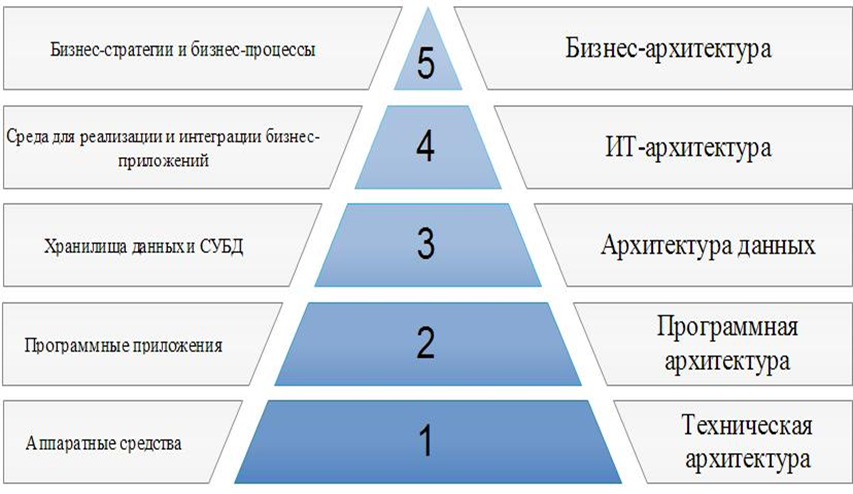

### Вопросы

1. [Дайте идеологическое и конструктивное определения архитектуры ИС.](#1)
2. [Из совокупности каких архитектур состоит корпоративная архитектура ИС?](#2)
3. [Что представляет собой бизнес архитектура ИС? Опишите её функции.](#3)
4. [Что представляет собой ИТ-архитектура? Опишите её функции.](#4)
5. [Что представляет собой архитектура данных? Опишите её функции.](#5)
6. [Что представляет собой программная архитектура? Опишите её функции.](#6)
7. [Что представляет собой техническая архитектура? Опишите её функции.](#7)
8. [Что такое доменная архитектура?](#8)
9. [Выполните классификацию архитектур ИС, основанных на доменном подходе.](#9)
10. [Какие существуют стили проектирования?](#10)
11. [Опишите архитектурный стиль проектирования ИС.](#11)
12. [Опишите календарный стиль проектирования ИС.](#12)
13. [Опишите стиль проектирования ИС основанный на управлении требованиями.](#13)
14. [Опишите стиль проектирования ИС основанный на процессе разработки документации.](#14)
15. [Опишите стиль проектирования ИС основанный на управлении качеством.](#15)
16. [Назовите атрибуты качества ИС по госту ISO 9126.](#16)
17. [Опишите направление развития платформенных архитектур ИС.](#17)
18. [Какие системы могут иметь автономную архитектуру?](#18)
19. [Опишите особенности ИС с централизованной архитектурой.](#19)
20. [Опишите характеристики систем с распределённой архитектурой.](#20)
21. [Назовите виды распределённых архитектур. Опишите их особенности.](#21)
22. [Опишите особенности файл-серверной архитектуры (достоинства, недостатки).](#22)
23. [Опишите особенности клиент-серверной архитектуры (достоинства, недостатки).](#23)
24. [Опишите особенности многоуровневой клиент-серверной архитектуры (достоинства, недостатки).](#24)
25. [В чём отличия архитектур «толстый клиент» и «тонкий клиент»?](#25)
26. [Опишите особенности архитектуры Web-приложений (как осуществляется работа сервера и рабочей станции).](#26)
27. [Какие открытые стандарты и протоколы лежат в основе Web-сервисов?](#27)
28. [Перечислите технологии, поддерживающие концепцию распределённых объектных систем.](#28)
29. [Что такое паттерны? В чём состоит их значимость?](#29)
30. [Что из себя представляет процесс разработки ИС? Какие модели ИС при этом необходимо создать?](#30)
31. [Дайте определение и опишите назначение языка UML.  Опишите типы диаграмм языка UML.](#31)
32. [Опишите UML диаграмму прецедентов (элементы, назначение).](#32)
33. [Опишите UML диаграмму классов (элементы, назначение).](#33)
34. [Опишите UML диаграмму последовательностей (элементы, назначение).](#34)
35. [Чем определяется стратегия проектирования ИС? Дайте определение жизненному циклу ИС. Какие стадии он включает?](#35)
36. [Опишите каскадную модель жизненного цикла ИС. Достоинства и недостатки.](#36)
37. [Опишите спиральную модель жизненного цикла ИС. Достоинства и недостатки.](#37)
38. [Опишите поэтапную модель жизненного цикла ИС. Достоинства и недостатки.](#38)
39. [В чём состоит концепция хранилищ данных. Опишите проблематику построения ХД.](#39)
40. [Что такое интеграция данных. В чём отличие виртуальных и физических ХД. Что такое витрина данных.](#40)
41. [Что такое OLAP-система, опишите её назначение и особенности](#41)
42. [Какие слои включает в себя архитектура OLAP-системы.](#42)
43. [Опишите слой извлечения, преобразования и загрузки данных OLAP-системы.](#43)
44. [Опишите слой хранения данных OLAP-системы.](#44)
45. [Опишите слой анализ данных OLAP-системы. ](#45)
46. [Чем отличаются системы OLTP и OLAP? ](#46)
47. [Чем отличается хранение данных в OLTP-системах и в ХД.](#47)
48. [Дайте определение гиппер-куба. Какие операции можно производить в гиппер-кубе.](#48)
49. [Опишите процесс усложнения модели данных, т.е. как получить многомерные данные?](#49)
50. [Что такое таблица фактов? Для чего она предназначена?](#50)

Из совокупности каких архитектур состоит корпоративная архитектура ИС?

 

### 1. Дайте идеологическое и конструктивное определения архитектуры ИС.

Идеологическое определение архитектуры ИС.

* Набор решений, влияющих на совокупную стоимость владения ИС.
* Набор решений, неизменных при изменении бизнес-технологий

Конструктивное определение архитектуры ИС.

Набор ответов на вопросы:
* Что делает система?
* На какие части она разделяется?
* Как эти части взаимодействуют?
* Где эти части размещены?

---

 

### 2. Из совокупности каких архитектур состоит корпоративная архитектура ИС?

---

 

### 3. Что представляет собой бизнес архитектура ИС? Опишите её функции.

На уровне бизнес-архитектуры определяются стратегии ведения бизнеса, способы управления, принципы организации ключевые процессы, представляющие для бизнеса огромную важность.

---

 

### 4. Что представляет собой ИТ-архитектура? Опишите её функции.

Уровень ИТ-архитектуры является связующим. На нём формируется базовый набор сервисов, которые используются как на уровне программной архитектуры, так и на уровне архитектуры данных. 
Основной функцией ИТ-архитектуры является обеспечение функционирования важных бизнес-приложений для достижения обозначенных бизнес-целей

---

 

### 5. Что представляет собой архитектура данных? Опишите её функции.

Архитектура данных объединяет в себе как физические хранилища данных, так и средства управления данными. На этом уровне описываются логические и физические модели данных, определяются правила целостности, составляются ограничения для данных.

---

 

### 6. Что представляет собой программная архитектура? Опишите её функции.

Программная архитектура представляет собой совокупность компьютерных программ, предназначенных для решения конкретных задач. Данный тип архитектуры необходим для описания приложений, входящих в состав информационной системы.

---

 

### 7. Что представляет собой техническая архитектура? Опишите её функции.

Техническая архитектура описывает все аппаратные средства, использующиеся при выполнении заявленного набора функций, а также включает средства обеспечения сетевого взаимодействия и надёжности.

---

 

### 8. Что такое доменная архитектура?

В последние годы всё более широкое распространение получил доменный подход к описанию архитектуры ИС. 

Доменная архитектура – эталонная модель, описывающая множество систем, которые реализуют похожую структуру, функциональность и поведение. 

Доменную архитектуру можно рассматривать как метамодель, описывающую множество решений.

В схемах классификации архитектур ИС, основанных на доменном подходе, на верхнем уровне выделяются два типа доменов: 

* домены задач,
* домены решений.

---

 

### 9. Выполните классификацию архитектур ИС, основанных на доменном подходе.

Выполните классификацию архитектур ИС, основанных на доменном подходе.

Доменная архитектура – эталонная модель, описывающая множество систем, которые реализуют похожую структуру, функциональность и поведение. 

Доменную архитектуру можно рассматривать как метамодель, описывающую множество решений.

В схемах классификации архитектур ИС, основанных на доменном подходе, на верхнем уровне выделяются два типа доменов: 

* домены задач (по характеру решаемых задач, по типу 
* домена, по предметной области, по степени автоматизации, по масштабности применения)
* домены решений (программная и технологическая архитектура)

---

 

### 10. Какие существуют стили проектирования?

Архитектурный стиль:во главу угла ставится создание фреймворков  (каркасов, типовых решений), которые могут быть легко адаптированы ко всем потенциальным требованиям всех потенциальных заказчиков.

Основанный на календарном планировании: основа– график проектных работ. Работа по проектированию выполняется поэтапно. Решения принимаются согласно целей и задач конкретного этапа.

Основанный на управлении требованиями: Основное внимание уделяется функциональным характеристикам системы. Успешно отслеживаются требования в плане реализации функциональности ИС. Этот подход эффективен в случае, если требования определены и не изменяются в процессе проектирования.

Основанный на управлении качеством: широкое использование различных мер для отслеживания критических с точки зрения функционирования системы параметров. Используется когда необходимо создать системы с экстремальными характеристиками.

Основанный на процессе разработки документации: используется в правительственных организациях и крупных компаниях. Ориентирован на разработку документации

---

 

### 11.	Опишите архитектурный стиль проектирования ИС.

RUP - одна из самых популярных технологий проектирования ИС, опирающаяся в качестве инструмента на язык визуального моделирования UML.  В методологии RUP реализуются следующие подходы:

* Итерационная и инкрементная (наращиваемая) разработка.
* Построение системы на базе архитектуры информационной системы.
* Планирование и управление проектом осуществляется на основе функциональных требований к информационной системе.

---

 

### 12.	Опишите календарный стиль проектирования ИС.

Основа календарного стиля – график проектных работ. Работа по проектированию выполняется поэтапно. Решения принимаются согласно целей и задач конкретного этапа.

---

 

### 13. Опишите стиль проектирования ИС основанный на управлении требованиями.

Основное внимание в стиле основанном на управлении требованиями уделяется функциональным характеристикам системы. Успешно отслеживаются требования в плане реализации функциональности ИС. 
Этот подход эффективен в случае, если требования определены и не изменяются в процессе проектирования.

---

 

### 14. Опишите стиль проектирования ИС основанный на процессе разработки документации.

Используется в правительственных организациях и крупных компаниях. Ориентирован на разработку документации.

---

 

### 15. Опишите стиль проектирования ИС основанный на управлении качеством.

Широкое использование различных мер для отслеживания критических с точки зрения функционирования системы параметров. Используется когда необходимо создать системы с экстремальными характеристиками

---

 

### 16. Назовите атрибуты качества ИС по госту ISO 9126.

Функциональность, надёжность, производительность, удобство использования, удобство сопровождения, переносимость.

---

 

### 17. Опишите направление развития платформенных архитектур ИС.

Опишите направление развития платформенных архитектур ИС.
Обеспечение интеграции, построения единого информационного пространства:

* автономные
* централизованные
* распределённые

---

 

### 18. Какие системы могут иметь автономную архитектуру?

Автономными архитектурами могут быть сервисные программы, системные утилиты, текстовые и графические редакторы, компиляторы, достаточно простые корпоративные программы.
Развитая корпоративная ИС не может состоять из отдельных, не связанных между собой компонентов.

---

 

### 19. Опишите особенности ИС с централизованной архитектурой.

Работой систем с централизованной архитектурой управляет хост-ЭВМ. Пользователи совместно используют дорогие ресурсы ЭВМ и дорогие периферийные устройства. Отсутствует необходимость администрирования рабочих мест пользователя.

---

 

### 20. Опишите характеристики систем с распределённой архитектурой.

Совместное использование ресурсов (аппаратных и программных)
* Открытость (возможность расширения системы путём добавления новых ресурсов)
* Параллельность (несколько процессов могут одновременно выполняться на разных компьютерах в сети)
* Масштабируемость (возможность добавления новых свойств и методов)
* Отказоустойчивость (возможность дублирования информации и устойчивость к ошибкам)
* Прозрачность (полный доступ к ресурсам системы, но от пользователей скрыта информация о распределении ресурсов по системе)

---

 

### 21. Назовите виды распределённых архитектур. Опишите их особенности.

Архитектура «файл-сервер»: Сетевой ресурс (сервер) используется приложениями для хранения программ и данных, обеспечивается многопользовательский режим работы с данными и удобство централизованного управления доступом к ним.Функции клиентов: интерфейс пользователя, логика обработки, управление запросами.По сети передаётся большой объём данных (не обработанные запросы).

Архитектура «клиент-сервер»: Сервер - система, процесс, компьютер, владеющие каким-либо вычислительным ресурсом (памятью, временем процессора, файлами и т. д.).Клиент -  система, процесс, компьютер, пользователь, делающие запрос к серверу на использование ресурса.Задания или сетевая нагрузка распределены между поставщиками слуг (серверами) и заказчиками услуг (клиентами). Функции сервера: физическое хранение данных, логика обработки, управление запросами.По сети передаются результаты обработанных запросов.

Архитектура Web-приложений (Web-сервисов): Передачу с сервера на рабочую станцию объектов по запросам, поступающим от навигатора, обеспечивает функционирующая на сервере программа, называемая Web-сервисом. Web-сервис – приложение, доступное через Internet и предоставляющее некоторые услуги, форма которых не зависит от поставщика (т.к. используется универсальный формат данных - XML).В основе Web-сервисов лежат открытые стандарты и протоколы:SOAPUDDIWSDL

---

 

### 22.	Опишите особенности файл-серверной архитектуры (достоинства, недостатки).

Сетевой ресурс (сервер) используется приложениями для хранения программ и данных, обеспечивается многопользовательский режим работы с данными и удобство централизованного управления доступом к ним.
Функции клиентов: интерфейс пользователя, логика обработки, управление запросами.По сети передаётся большой объём данных (не обработанные запросы).

---

 

### 23.	Опишите особенности клиент-серверной архитектуры (достоинства, недостатки).

Сервер - система, процесс, компьютер, владеющие каким-либо вычислительным ресурсом (памятью, временем процессора, файлами и т. д.).

Клиент -  система, процесс, компьютер, пользователь, делающие запрос к серверу на использование ресурса.

Задания или сетевая нагрузка распределены между поставщиками слуг (серверами) и заказчиками услуг (клиентами). 

Функции сервера: физическое хранение данных, логика обработки управление запросами.

По сети передаются результаты обработанных запросов

---

 

### 24.	Опишите особенности многоуровневой клиент-серверной архитектуры (достоинства, недостатки).

Функции сервера баз данных: физическое хранение данных,
управление данными, логика обработки, управление запросами.

Функции сервера приложений: логика обработки, реализация бизнес-правил.

Функции клиента: интерфейс пользователя. 

Достоинства: 

* клиентское ПО не нуждается в администрировании
* низкие требования к скорости канала между терминалами и сервером приложений
* низкие требования к производительности и техническим характеристикам терминалов

---

 

### 25. В чём отличия архитектур «толстый клиент» и «тонкий клиент»?

При использовании режима "Толстый клиент" - одноуровневая структура - клиентские приложения находятся непосредственно на машинах пользователей либо частично на сервере в виде системы хранимых процедур. Сложность клиентской части порой требует ее администрирования. Использование системы хранимых процедур в значительной мере снижает нагрузку на сеть.

При использовании режима "Тонкий клиент" - многоуровневая структура - приложения пользователей находятся и выполняются отдельным мощным сервером (сервер приложений, который может быть на одном компьютере с сервером БД), что в значительной мере снижает требования к пользовательским машинам.

---

 

### 26.	Опишите особенности архитектуры Web-приложений (как осуществляется работа сервера и рабочей станции).

Передачу с сервера на рабочую станцию объектов по запросам, поступающим от навигатора, обеспечивает функционирующая на сервере программа, называемая Web-сервисом. 

Web-сервис – приложение, доступное через Internet и предоставляющее некоторые услуги, форма которых не зависит от поставщика (т.к. используется универсальный формат данных - XML).

---

 

###  27. Какие открытые стандарты и протоколы лежат в основе Web-сервисов? 

В основе Web-сервисов лежат открытые стандарты и протоколы:

* SOAP
* UDDI
* WSDL

---

 

### 28. Перечислите технологии, поддерживающие концепцию распределённых объектных систем.

ИС, включающая в себя множество взаимосвязанных удалённых программных объектов, называется распределённой объектной системой.
Технологии, поддерживающие концепцию распределённых объектных систем: EJB , DCOM, CORBA

---

 

### 29.	Что такое паттерны? В чём состоит их значимость?

Паттерны (шаблоны) - набор объектов, организованных определённым образом для решения конкретного класса задач.

Значимость паттернов состоит в том, что их использование позволяет выделить часто встречающиеся проблемы, дать им имена, предложить типовые решения, которые можно внедрить в создаваемые ИС.

---

 

### 30.	Что из себя представляет процесс разработки ИС? Какие модели ИС при этом необходимо создать?

Стратегия проектирования ИС определяется использованием соответствующей модели жизненного цикла, определяющей последовательность стадий проектирования и выполняемых в них процессов.

---

 

### 31.	Дайте определение и опишите назначение языка UML.  Опишите типы диаграмм языка UML.

**Дайте определение и опишите назначение языка UML.**

Унифицированный язык объектно-ориентированного моделирования  UML является самой используемой технологией в области программной инженерии. 

UML позволяет системным архитекторам представлять свое видение системы в виде набора стандартных диаграмм, которые, к тому же, служат отличным средством коммуникации в команде разработчиков и прекрасным помощником в общении с заказчиком. 

UML позволяет создавать такие простые и понятные модели, описывающие систему с разных сторон, которые можно показать заказчику и обсудить с ним, т. е. служит средством коммуникации в команде.

**Опишите типы диаграмм языка UML.**

Диаграмма прецедентов - описывает функции системы по отношению к различным пользователям или другим системам

Диаграмма классов - описание совокупности объектов с общими атрибутами операциями, отношениями и семантикой 

Диаграмма последовательностей отображает взаимодействие объектов в динамике и относится к диаграммам взаимодействия UML, описывающим поведенческие аспекты системы, но рассматривает взаимодействие объектов во времени.

---

 

### 32. Опишите UML диаграмму прецедентов (элементы, назначение).

Описывает функции системы по отношению к различным пользователям или другим системам (сущностям).

Сущности, с которыми взаимодействует система в процессе своей работы, называются экторами, причем каждый эктор ожидает, что система будет вести себя строго определенным, предсказуемым образом. 

Прецедент - описание отдельного аспекта поведения системы с точки зрения пользователя, это описание множества последовательных событий (включая варианты), выполняемых системой, которые приводят к наблюдаемому эктором результату. 

Графически эктор изображается " человечком ", прецеденты обозначаются в виде эллипса, внутри которого указано его название

---

 

### 33. Опишите UML диаграмму классов (элементы, назначение).

Класс - категория вещей, которые имеют общие атрибуты и операции. 

Классы - это строительные блоки любой объектно-ориентированной системы. 

Они представляют собой описание совокупности объектов с общими атрибутами, операциями, отношениями и семантикой. 

Классы используются в процессе анализа предметной области для составления словаря предметной области разрабатываемой системы. 

Диаграмма классов - конечный результат проектирования и отправная точка процесса разработки.

Классы изображаются в виде прямоугольников, с отображением имени классов, их атрибутами и операциями, осуществляемыми на ними.

---

 

### 34. Опишите UML диаграмму последовательностей (элементы, назначение).

Отображает взаимодействие объектов в динамике и относится к диаграммам взаимодействия UML, описывающим поведенческие аспекты системы, но рассматривает взаимодействие объектов во времени. 

Она отображает временные особенности передачи и приема сообщений объектами.

В UML взаимодействие объектов понимается как обмен информацией между ними. При этом информация принимает вид сообщений. 

Объекты обозначаются прямоугольниками с подчеркнутыми именами, сообщения (вызовы методов) - линиями со стрелками, возвращаемые результаты - пунктирными линиями со стрелками. 

Прямоугольники на вертикальных линиях под каждым из объектов показывают "время жизни" объектов.

---

 

### 35.	Чем определяется стратегия проектирования ИС? Дайте определение жизненному циклу ИС. Какие стадии он включает?

**Чем определяется стратегия проектирования ИС?**

Стратегия проектирования ИС определяется использованием соответствующей модели жизненного цикла, определяющей последовательность стадий проектирования и выполняемых в них процессов.

Модель жизненного цикла - структура, содержащая стадии, процессы (действия и задачи), которые осуществляются в ходе разработки, функционирования и сопровождения программного продукта в течение всей жизни системы, от определения требований до завершения ее использования.

**Дайте определение жизненному циклу ИС. Какие стадии он включает?**

* Жизненный цикл — это не временной период существования, а процесс последовательного изменения состояния, обусловленный видом производимых воздействий.
* Под термином «жизненный цикл системы» обычно понимают эволюцию новой системы в виде нескольких ступеней, включающих такие важные стадии, как концепция, разработка, производство, эксплуатация и окончательное выведение из эксплуатации.

---

 

### 36.	Опишите каскадную модель жизненного цикла ИС. Достоинства и недостатки.

Каскадная модель предусматривает последовательное выполнение всех этапов проекта в строго фиксированном порядке. 

Переход на следующий этап означает полное завершение работ на предыдущем этапе. 

**Достоинства.**

Каскадная модель имеет ряд положительных сторон, благодаря которым она хорошо зарекомендовала себя при выполнении различного рода инженерных разработок и получила широкое распространение. 

На каждом этапе формируется законченный набор проектной документации, отвечающей критериям полноты и согласованности. 

На заключительных этапах также разрабатывается пользовательская документация, охватывающая все предусмотренные стандартами виды обеспечения информационной системы (организационное, методическое, информационное, программное, аппаратное). 

Выполняемые в логичной последовательности этапы работ позволяют планировать сроки завершения и соответствующие затраты. 

**Недостатки**

Перечень недостатков каскадной модели при ее использовании для разработки информационных систем достаточно обширен: 

* существенная задержка в получении результатов; 
* ошибки и недоработки на любом из этапов проявляются, как правило, на последующих этапах работ, что приводит к необходимости возврата назад; 
* сложность параллельного ведения работ по проекту; 
* чрезмерная информационная перенасыщенность каждого из этапов; сложность управления проектом; 
* высокий уровень риска и ненадежность инвестиций

---

 

### 37.	Опишите спиральную модель жизненного цикла ИС. Достоинства и недостатки.

На каждом витке спирали выполняется создание очередной версии продукта, уточняются требования проекта, определяется его качество и планируются работы следующего витка. 

Каждая итерация представляет собой законченный цикл разработки, приводящий к выпуску внутренней или внешней версии изделия (или подмножества конечного продукта), которое совершенствуется от итерации к итерации, чтобы стать законченной системой. 

Особое внимание уделяется начальным этапам разработки - анализу и проектированию, где реализуемость тех или иных технических решений проверяется и обосновывается посредством создания прототипов (макетирования).

---

 

### 38.	Опишите поэтапную модель жизненного цикла ИС. Достоинства и недостатки.

Разработка ИС ведется итерациями с циклами обратной связи между этапами. Межэтапные корректировки позволяют учитывать реально существующее взаимовлияние результатов разработки на различных этапах; время жизни каждого из этапов растягивается на весь период разработки

---

 

### 39.	В чём состоит концепция хранилищ данных. Опишите проблематику построения ХД.

**В чём состоит концепция хранилищ данных.**

В основе концепции ХД лежит идея разделения данных, используемых для оперативной обработки и для решения задач анализа, что позволяет оптимизировать структуры хранения. 

ХД позволяет интегрировать ранее разъединенные детализированные данные, содержащиеся в исторических архивах, накапливаемых в традиционных OLTP-системах, поступающих из внешних источников, в единую базу данных, осуществляя их предварительное согласование и, возможно, агрегацию.

ХД - предметно-ориентированный, интегрированный, редко меняющийся, поддерживающий хронологию набор данных, организованный для целей поддержки принятия решений. Предметная ориентация означает, что ХД интегрируют информацию, отражающую различные точки зрения на предметную область. 

Интеграция предполагает, что данные, хранящиеся в ХД, приводятся к единому формату. Поддержка хронологии означает, что все данные в ХД соответствуют последовательным интервалам времени.

**Опишите проблематику построения ХД.**

* интеграция разнородных данных. Данные в ХД поступают из разнородных OLTP-систем, которые физически могут быть расположены на различных узлах сети. При проектировании и разработке ХД необходимо решать задачу интеграции различных программных платформ хранения;
* эффективное хранение и обработка больших объемов данных. Построение ХД предполагает накопление данных за значительные периоды времени, что ведет к постоянному росту объемов дисковой памяти, а также росту объема оперативной памяти, требующейся для обработки этих данных;
* организация многоуровневых справочников метаданных. Конечным пользователям СППР необходимы метаданные, описывающие структуру хранящихся в ХД данных, а также инструменты их визуализации;
* обеспечение информационной безопасности ХД. Сводная информация о деятельности компании, как правило, относится к коммерческой тайне и подлежит защите; кроме того, в ХД могут содержаться персональные данные клиентов и сотрудников, которые также необходимо защищать. Для выполнения этой функции должна быть разработана политика безопасности ХД и связанной с ним инфраструктуры, а также реализованы предусмотренные в политике организационные и программно-технические мероприятия по защите информации.

---

 

### 40.	Что такое интеграция данных. В чём отличие виртуальных и физических ХД. Что такое витрина данных.

**Что такое интеграция данных?**

Интеграция предполагает, что данные, хранящиеся в ХД, приводятся к единому формату.

**В чём отличие виртуальных и физических ХД?**

При загрузке данных из OLTP-системы в ХД происходит дублирование данных. Однако в ходе этой загрузки данные фильтруются, поскольку не все из них имеют значение для проведения процедур анализа. 

В ХД хранится обобщенная информация, которая в OLTP-системе отсутствует.

Избыточность информации можно свести к нулю, используя виртуальное ХД. В такой системе данные из OLTP-системы не копируются в единое хранилище.

Они извлекаются, преобразуются и интегрируются непосредственно при выполнении аналитических запросов в режиме реального времени. 
Фактически такие запросы напрямую передаются к OLTP-системе

**Что такое витрина данных?**

Сокращение затрат на проектирование и разработку ХД может быть достигнуто путем создания витрин данных (ВД). 

ВД - это упрощенный вариант ХД, содержащий только тематически объединенные данные

ВД содержит данные, ориентированные на конкретного пользователя, существенно меньше по объему, и для ее реализации требуется меньше затрат. ВД могут строиться как самостоятельно, так и вместе с ХД. 

ВД внедряются гораздо быстрее и быстрее виден эффект от их использования. Недостатками ВД является многократное хранение одних и тех же данных в различных ВД и отсутствие консолидированности на уровне предметной области.

---

 

### 41.	Что такое OLAP-система, опишите её назначение и особенности

OLAP (OnlineAnalyticalProcessing) - технология оперативной аналитической обработки данных, использующая методы и средства для сбора, хранения и анализа многомерных данных в целях поддержки процессов принятия решений.

Основное назначение OLAP-систем - поддержка аналитической деятельности, произвольных запросов пользователей - аналитиков. Цель OLAP-анализа - проверка возникающих гипотез.

---

 

### 42.	Какие слои включает в себя архитектура OLAP-системы. 

---

 

### 43. Опишите слой извлечения, преобразования и загрузки данных OLAP-системы.

Данные поступают из различных внутренних OLTP-систем (подсистем ввода), от подчиненных структур, от внешних организаций в соответствии с установленным регламентом, формами и макетами отчетности. 
Вся эта информация проверяется, согласуется, преобразуется и помещается в хранилище и витрины данных.

---

 

### 44.	Опишите слой хранения данных OLAP-системы.

Слой хранения данных предназначен непосредственно для хранения значимой, проверенной, согласованной, непротиворечивой и хронологически целостной информации, которую с достаточно высокой степенью уверенности можно считать достоверной.

Цель ХД - обеспечить целостность и поддерживать хронологию всевозможных корпоративных данных, и с этой точки зрения оно нейтрально по отношению к приложениям. В связи с этим в большинстве случаев для выполнения определенного комплекса функционально замкнутых аналитических задач рационально создавать витрины данных, в основе которых может быть как многомерная, так и реляционная модель данных

---

 

### 45.	Опишите слой анализ данных OLAP-системы. 

Современный подход к инструментальным средствам анализа не ограничивается использованием какой-то одной технологии.

В настоящее время принято различать следующие основные виды аналитической деятельности:

* стандартная отчетность;
* нерегламентированные запросы;
* многомерный анализ (OLAP);
* извлечение знаний (data mining).

---

 

### 46.	Чем отличаются системы OLTP и OLAP? 

OLAP - многомерный анализ, т.е. полномасштабная OLAP-система должна выполнять сложные и разнообразные функции, включающие сбор данных из различных источников, их согласование, преобразование и загрузку в хранилище, хранение аналитической информации, регламентную отчетность, поддержку произвольных запросов, многомерный анализ и др.

OLAP - технология оперативной аналитической обработки данных, использующая методы и средства для сбора, хранения и анализа многомерных данных в целях поддержки процессов принятия решений.

Основное назначение OLAP-систем - поддержка аналитической деятельности, произвольных запросов пользователей - аналитиков. Цель OLAP-анализа - проверка возникающих гипотез.

Данные поступают из различных внутренних OLTP-систем (подсистем ввода), от подчиненных структур, от внешних организаций в соответствии с установленным регламентом, формами и макетами отчетности. 

Вся эта информация проверяется, согласуется, преобразуется и помещается в хранилище и витрины данных.

После этого пользователи с помощью специализированных инструментальных средств получают необходимую им информацию для построения различных табличных и графических представлений, прогнозирования, моделирования и выполнения других аналитических задач.

---

 

### 47.	Чем отличается хранение данных в OLTP-системах и в ХД.

Чем отличается хранение данных в OLTP-системах и в ХД.
При загрузке данных из OLTP-системы в ХД происходит дублирование данных. Однако в ходе этой загрузки данные фильтруются, поскольку не все из них имеют значение для проведения процедур анализа. В ХД хранится обобщенная информация, которая в OLTP-системе отсутствует. Избыточность информации можно свести к нулю, используя виртуальное ХД. В такой системе данные из OLTP-системы не копируются в единое хранилище. Они извлекаются, преобразуются и интегрируются непосредственно при выполнении аналитических запросов в режиме реального времени. Фактически такие запросы напрямую передаются к OLTP-системе.

---

 

### 48.	Дайте определение гиппер-куба. Какие операции можно производить в гиппер-кубе.

Возможность анализа зависимостей между различными параметрами предполагает возможность представления данных в виде многомерной модели - гиперкуба  или OLAP-куба.

Оси куба представляют собой измерения, по которым откладывают параметры, относящиеся к анализируемой предметной области, например, названия товаров и названия месяцев года.

На пересечении осей измерений располагаются данные, количественно характеризующие анализируемые факты - меры, например, объемы продаж, выраженные в единицах продукции.

В простейшем случае двумерного куба получается таблица, показывающая значения уровней продаж по товарам и месяцам.

---

 

### 49.	Опишите процесс усложнения модели данных, т.е. как получить многомерные данные?

Увеличение числа измерений данных о продажах не только по месяцам и товарам, но и по регионам. В этом случае куб становится трехмерным;

* усложнение содержимого ячейки например, нас может интересовать не только уровень продаж, но и чистая прибыль или остаток на складе. В этом случае в ячейке будет несколько значений;

* введение иерархии в пределах одного измерения общее понятие "время" связано с иерархией значений: год состоит из кварталов, квартал из месяцев и т.д.

---

 

### 50.	Что такое таблица фактов? Для чего она предназначена?

Таблица фактов - является основной таблицей хранилища данных. 
Как правило, она содержит сведения об объектах или событиях, совокупность которых будет в дальнейшем анализироваться. 

Обычно говорят о четырех наиболее часто встречающихся типах фактов: 

* факты, связанные с транзакциями. Они основаны на отдельных событиях (типичными примерами которых являются телефонный звонок или снятие денег со счета с помощью банкомата);

* факты, связанные с "моментальными снимками" .Основаны на состоянии объекта (например, банковского счета) в определенные моменты времени, например на конец дня или месяца. Типичными примерами таких фактов являются объем продаж за день или дневная выручка;

* факты, связанные с элементами документа . Основаны на том или ином документе (например, счете за товар или услуги) и содержат подробную информацию об элементах этого документа (например, количестве, цене, проценте скидки);

* факты, связанные с событиями или состоянием объекта . Представляют возникновение события без подробностей о нем (например, просто факт продажи или факт отсутствия таковой без иных подробностей).

* Таблица фактов, как правило, содержит уникальный составной ключ, объединяющий первичные ключи таблиц измерений. Чаще всего это целочисленные значения либо значения типа "дата/время" - ведь таблица фактов может содержать сотни тысяч или даже миллионы записей, и хранить в ней повторяющиеся текстовые описания, как правило, невыгодно - лучше поместить их в меньшие по объему таблицы измерений. 

* При этом как ключевые, так и некоторые неключевые поля должны соответствовать будущим измерениям OLAP-куба. Помимо этого таблица фактов содержит одно или несколько числовых полей, на основании которых в дальнейшем будут получены агрегатные данные

---

