# «Информационные системы и технологии» - 3 курс

## Вопросы.

1. [Как конструктивно определить архитектуру ИС. Опишите процесс разработки ИС](#1-как-конструктивно-определить-архитектуру-ис-опишите-процесс-разработки-ис)
2. [Технология проектирования RUP](#2-технология-проектирования-rup)
3. [Методология проектирования SADT](#3-методология-проектирования-sadt)
4. [Стандарты моделирования IDEF.](#4-стандарты-моделирования-idef)
5. [Методология проектирования RAD.](#5-методология-проектирования-rad)
6. [Понятие фреймворка.](#6-понятие-фреймворка)
7. [Классификация фреймворков по месту применения.](#7-классификация-фреймворков-по-месту-применения)
8. [Классификация фреймворков по способу использования.](#8-классификация-фреймворков-по-способу-использования)
9. [Классификация фреймворков по масштабу применения.](#9-классификация-фреймворков-по-масштабу-применения)
10. [Фреймворк Захмана.](#10-фреймворк-захмана)
11. [Фреймворк TOGAF.](#11-фреймворк-togaf)
12. [Фреймворк DoDAF.](#12-фреймворк-dodaf)
13. [Фреймворк FEA.](#13-фреймворк-fea)
14. [Фреймворк Gartner.](#14-фреймворк-gartner)
15. [Архитектура Web-приложений (Web-сервисов).](#15-архитектура-web-приложений-web-сервисов)
16. [Открытые стандарты и протоколы, лежащие в основе Web-сервисов.](#16-открытые-стандарты-и-протоколы-лежащие-в-основе-web-сервисов)
17. [Технологии, поддерживающие концепцию распределённых объектных систем. EJB.](#17-технологии-поддерживающие-концепцию-распределённых-объектных-систем-ejb)
18. [Технологии, поддерживающие концепцию распределённых объектных систем. DCOM.](#18-технологии-поддерживающие-концепцию-распределённых-объектных-систем-dcom)
19. [Технологии, поддерживающие концепцию распределённых объектных систем. CORBA.](#19-технологии-поддерживающие-концепцию-распределённых-объектных-систем-corba)
20. [Информационная система корпорации (КИС). Состав, базовые модели.](#20-информационная-система-корпорации-кис-состав-базовые-модели)
21. [Объектно-ориентированная модель предприятия.](#21-объектно-ориентированная-модель-предприятия)
22. [Основные абстрактные модели для моделирования в инструментальной подсистеме.](#22-основные-абстрактные-модели-для-моделирования-в-инструментальной-подсистеме)
23. [Каркасы проектирования.](#23-каркасы-проектирования)
24. [Различия между паттернами и каркасами.](#24-различия-между-паттернами-и-каркасами)
25. [Слои каркасов, обеспечивающих описание и реализацию проектных решений КИС в терминах базовых метамоделей предметной области.](#25-слои-каркасов-обеспечивающих-описание-и-реализацию-проектных-решений-кис-в-терминах-базовых-метамоделей-предметной-области)
26. [Варианты моделей спецификации.](#26-варианты-моделей-спецификации)
27. [Иерархическая структура каркасов для решения задач управления ЖЦИ.](#27-иерархическая-структура-каркасов-для-решения-задач-управления-жци)
28. [Пятиуровневая архитектура приложения КИС.](#28-пятиуровневая-архитектура-приложения-кис)
29. [Сервисно-ориентированная архитектура (SOA).](#29-сервисно-ориентированная-архитектура-soa)
30. [Основополагающие условия для моделирования SOA. Преимущества внедрения архитектуры SOA.](#30-основополагающие-условия-для-моделирования-soa-преимущества-внедрения-архитектуры-soa)

<a href="#вопросы" style="display: inline-block; position: fixed; bottom: 0; right: 0;">To </a>
___

## Ответы.

### 1. Как конструктивно определить архитектуру ИС. Опишите процесс разработки ИС.

#### Как конструктивно определить архитектуру ИС. 

Для того чтобы конструктивно определить архитектуру ИС, необходимо ответить на ряд вопросов:
1. Что делает система?
2. На какие составные часть она разделена?
3. Каким образом происходит взаимодействие этих частей?
4. Как и где эти части размещены?

Таким образом, можно считать архитектуру информационной системы моделью, определяющей стоимость владения через имеющуюся в данной системе инфраструктуру.

#### Опишите процесс разработки ИС.

Процесс разработки ИС - процесс построения и последовательного преобразования ряда согласованных моделей на всех этапах жизненного цикла ИС. 

Модели:

* организации
* деятельности организации
* требований к ИС
* проекта ИС
* требований к приложениям и т.д. 

___

### 2. Технология проектирования RUP.

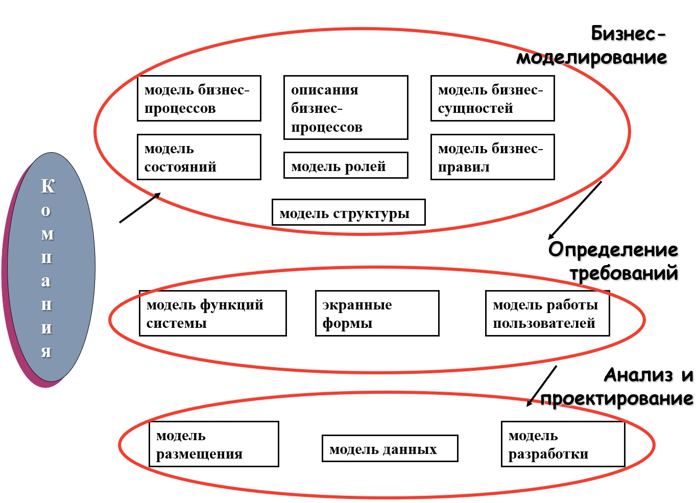

Разработка информационной системы выполняется итерациями. Это отдельные проекты, небольшие по объему и содержанию, которые включают свои собственные этапы анализа требований, проектирования, реализации, тестирования, интеграции. 

Заканчиваются итерации созданием работающей информационной подсистемы.
Итерационный цикл характеризуется периодической обратной связью и может адаптироваться к ядру разрабатываемой системы. 

Создаваемая информационная система постепенно растет и совершенствуется.

___

### 3. Методология проектирования SADT.

Методология SADT (Structured Analysis and Design Technique - методология структурного анализа проектирования), разработанная Дугласом Т. Россом в 1969-1973 годах базируется на структурном анализе систем и графическом представление организации в виде системы функций, которые имеют три класса структурных моделей:

1. Функциональная модель.
2. Информационная модель.
3. Динамическая модель.

Процесс моделирования по методологии SADT состоит из следующих этапов:

1. Сбор информации и анализ информации о предметной области.
2. Документирование полученной информации.
3. Моделирование IDEF.
4. Корректура модели в процессе итеративного рецензирования.

Методология моделирования IDEF, использует формализованный процесс моделирования информационных систем и имеет следующие стадии: 

* анализ
* проектирование
* реализация
* объединение
* тестирование
* установка
* функционирование

___

### 4. Стандарты моделирования IDEF.

* IDEF0 - методология функционального моделирования. Система отображается в виде набора взаимосвязанных функциональных блоков.
* IDEF1 - методология моделирования информационных потоков внутри системы, позволяющая отображать и анализировать их структуру и взаимосвязи;
* IDEF1X - методология построения реляционных структур. 
* IDEF3 - методология документирования процессов. С помощью IDEF3 описываются сценарий и последовательность операций для каждого процесса. 
* IDEF4 - методология построения объектно-ориентированных систем. 

___

### 5. Методология проектирования RAD.

Принципы RAD сформулированы в 1980 году сотрудником компании IBM Джеймсом Мартином. 
В настоящее время методология RAD стала общепринятой схемой для проектирования разработки информационных систем. Средства разработки, основанные на RAD, очень популярны за счет использования таких программных сред разработки: IBM Lotus Domino Designer, Borland Delphi, Borland C++ Builder, Microsoft Visual Studio, Macromedia Flash и др

Данная методология охватывает все этапы жизненного цикла современных информационных систем.

Методология RAD — это комплекс специальных инструментальных средств, позволяющих оперировать с определенным набором графических объектов, функционально отображающих отдельные информационные компоненты приложений

Ограничения методологии RAD. Ее применение наиболее эффективно при создании сравнительно небольших систем, разрабатываемых для конкретного заказчика.

Методология RAD не подходит для создания сложных расчетных программ, операционных систем и программ управления сложными инженерно-техническими объектами; для разработки приложений, в которых интерфейс пользователя является вторичным, т.е. отсутствует наглядное определение логики работы системы (приложения реального времени, драйверы или службы); для разработки систем, от которых зависит безопасность людей, например систем управления транспортом или атомными электростанциями.

Методология RAD имеет следующие стадии:

* Моделирование информационных потоков между бизнес-функциями.
* Моделирование данных.
* Преобразование объектов данных, обеспечивающих реализацию бизнес-функций.
* Генерация (сборка) приложений.
* Тестирование и объединение.

Особенности использования методологии RAD:
* Для больших информационных систем требуется большой коллектив высококвалифицированных разработчиков (большой бюджет проекта).
* Применима при уверенном знании целевого бизнеса и необходимости срочного производства системы в течении 2-3 месяцев..

___

### 6. Понятие фреймворка. 

Термин фреймворк можно определить как общепринятые архитектурно-структурные решения и подходы к проектированию. Можно сказать, что фреймворк представляет собой общее решение сложной задачи. 

Фреймворки и паттерны имеют много общего: это подходы к повторному использованию кода. 

Различие: 
* фреймворк - это реализация системы паттернов проектирования. 
* фреймворк - исполняемая программа, паттерн - знание и опыт как решать конкретную задачу.

Фреймворк представляет собой скелетное решение достаточно крупной задачи и обычно включает в себя большое количество как паттернов, так и компонентов.

Фреймворки можно классифицировать по месту применения в системе, по способу использования и масштабу применения.

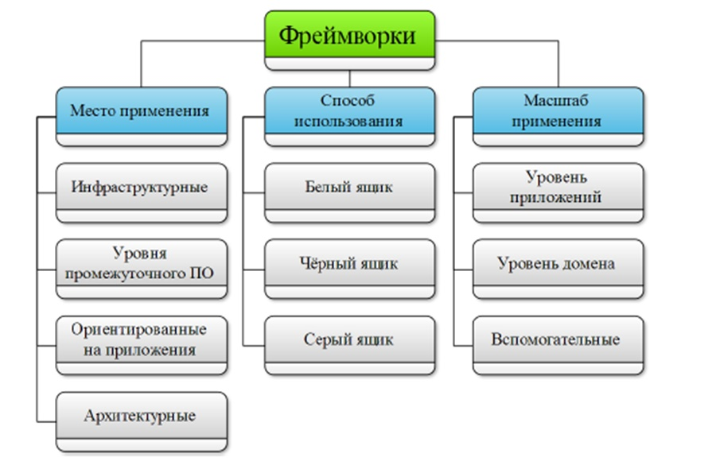

___

### 7. Классификация фреймворков по месту применения.

1. Инфраструктурные фреймворки упрощают процесс разработки инфраструктурных элементов, применяются внутри организации и не продаются.
2. Фреймворки уровня промежуточного программного обеспечения применяются для встраивания (интеграции) приложений и компонентов.
3. Фреймворки, ориентированные на приложения, используются для поддержки систем, ориентирован-ных на работу с конечными пользователями в конкретной предметной области.
4. Архитектурный фреймворк включает в себя описание заинтересованных лиц, типовые проблемы предметной области, архитектурные точки зрения и методы их интеграции.

___

### 8. Классификация фреймворков по способу использования.

1. Фреймворки, используемые по принципу белого ящика (архитектурные), применяют методы наследования и динамического связывания для формирования основных элементов приложения. Такие фреймворки определяются через интерфейсы объектов, добавляемых в систему. Для работы с ними необходима подробная информация о классах, расширение которых необходимо.
2. Фреймворки, функционирующие по принципу чёрного ящика (управляемыми данными): основными механизмами формирования приложений, в данном случае, выступают композиция и параметризация, при этом функциональность обеспечивается добавлением дополнительных компонентов. Процесс использования фреймворков, работающих по принципу чёрного ящика проще, чем работающих по принципу белого ящика, однако их разработка сложнее.
3. На практике применяют подход серого ящика , являющийся комбинацией обоих подходов.

___

### 9. Классификация фреймворков по масштабу применения.

1. Фреймворки уровня приложений предоставляют функционал по реализации типовых приложений (GUI, базы данных и т.д).
2. Фреймворки уровня домена применяются для создания приложений в определённой предметной области. 
3. Вспомогательные фреймворки применяются для решения частных задач.

___

### 10. Фреймворк Захмана.

Фреймворк Захмана является одним из самых старых архитектурных фреймворков. Он был создан сотрудником компании IBM Джоном Захманом. Захман заложил в основу своего фреймворка классификацию (таксономию) артефактов системы. Среди них можно выделить данные, функциональ-ность, модели, спецификации и документы. 

В результате, можно считать этот фреймворк онтологией верхнего уровня, описывающей конкретную систему.
Для построения таксономии Захманом предложено ответить на шесть вопросов о функционировании организации: что, как, где, кто, почему.

Данные вопросы относятся к следующим аспектам системы:

* используемые данные (что?);
* процессы и функции (как?);
* места выполнения процессов (где?);
* организации и персоналии (кто?);
* управляющие события (когда?);
* цели и ограничения, определяющие работу
* системы (почему?).

**Матрица Захмана**

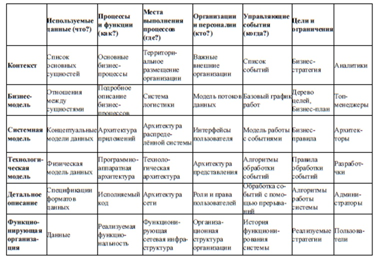

Отвечать на эти вопросы необходимо с различной степенью детализации. Описано шесть уровней:

1. уровень контекста;
2. уровень бизнес-описаний;
3. системный уровень;
4. технологический уровень;
5. технический уровень;
6. уровень реальной системы.

Применительно к каждому уровню детализации существует своё заинтересованное лицо, то есть точка зрения:

1. аналитики (уровень контекста);
2. топ-менеджеры (уровень бизнесописаний);
3. архитекторы (системный уровень);
4. разработчики (технологический уровень);
5. администраторы (технический уровень);
6. пользователи (уровень реальной системы).

По результатам проделанных действий сформировывается матрица размером 6 на 6, в каждой ячейке которой располагаются артефакты. Для заполнения ячеек введены следующие правила:

1. Колонки можно менять местами, но нельзя добавлять и удалять.
2. Каждой колонке соответствует собственная модель.
3. Каждая из моделей, соответствующих столбцов, должная быть уникальна.
4. Каждый уровень (строка) представляет собой описание системы с точки зрения группы пользователей (представляет отдельный вид).
5. Каждая из ячеек уникальна.
6. Каждая ячейка содержит описание аспекта реализации системы в виде модели и текстового документа.
7. Заполнение ячеек должно производиться последовательно сверху вниз.

Первая строка матрицы определяет контекст всех остальных и представляет собой общий взгляд на организацию. 

Вторая строка описывает функционирование организации в бизнес-терминах. 

Третья строка описывает бизнеспроцессы в терминах информационных систем. 

Четвёртая строка позволяется распределить данные и выполняемые над ними операции по конкретным аппаратным и программным платформам. 

Пятая строка описывает конкретные модели оборудования, сетевые топологии и программный код. 

Шестая строка описывает готовую систему в виде руководств пользователей, справочных баз данных и т.д.

Столбец **используемые данные**, в соответствии с уровнями, содержит в своих ячейках следующие артефакты: 

1 уровень - список основных сущностей; 
2 уровень - семантическая модель; 
3 уровень - нормализованная модель; 
4 уровень - физическая модель данных или иерархия классов; 
5 уровень - описание модели на языке управления данными; 
6 уровень - фактические наборы данных, статистики и т.д.

Столбец **процессы и функции** описывает порядок действий для детализации процесса перехода от миссии организации к описанию конкретных операций:

1 уровень - перечисление ключевых бизнес-процессов;
2 уровень - описание бизнес-процессов; 
3 уровень - описание операций над данными и архитектуры приложений; 
4 уровень - методы классов; 
5 уровень - программный код; 
6 уровень - исполняемые модули. 

С четвёртого уровня рассмотрение ведётся в рамках отдельных приложений.

Столбец **места выполнения процессов** определяет расположение компонент системы и сетевую инфраструктуру: 

1 уровень - расположение основных объектов; 
2 уровень - модель взаимодействия объектов; 
3 уровень - распределение компонентов информационной системы по узлам сети; 
4 уровень - физическая реализация на аппаратных и программных платформах;
5 уровень - используемые протоколы и спецификации каналов связи; 
6 уровень - описание функционирования сети.

Столбец **организации и персоналии** определяет участников процесса функционирования: 

1 уровень – список партнёров, подразделений организации, выполняемые функции; 
2 уровень – полная организационная диаграмма (могут присутствовать требования к информационной безопасности); 
3 уровень – участники бизнес-процессов и их роли; 
4 уровень – требования к пользовательским интерфейсам; 
5 уровень – правила доступа к объектам; 
6 уровень – физическая реализация в коде.

Столбец **управляющее событие** определяет временные параметры системы и бизнес-процессов:

1 уровень – список значимых для системы событий; 
2 уровень – базовый график работ; 
3 уровень – модели работы с событиями; 
4 уровень – алгоритмы обработки событий; 
5 уровень – программная реализация; 
6 уровень – история функционирования системы.

Столбец **цели и ограничения** указывает последовательность действий для перехода от задач бизнеса к требованиям для элементов системы: 

1 уровень – бизнес-стратегия; 
2 уровень – дерево целей и бизнес-план; 
3 уровень – правила и ограничения для бизнес-процессов; 
4 уровень – приложения, включаемые в состав системы; 
5 уровень – алгоритмы работы приложений; 
6 уровень – физическая реализация в коде

При помощи фреймворка Захмана нельзя описать динамику поведения системы (развитие), кроме того, в нём не существует механизма контроля за изменениями. 

Данный фреймворк распространяется на коммерческой основе.

___

### 11. Фреймворк TOGAF.

Фреймворк TOGAF (The Open Group Architecture Framework) представляет собой набор средств для разработки архитектур различного назначения.

С его помощью информационная система описывается как совокупность модулей.

В рамках TOGAF даётся особенное определение архитектуры – «формальное описание системы, или детальный план системы на уровне компонентов и методологии их реализации».

Общепринятое же определение архитектуры (в соответствии со стандартом ANSI/IEEE 1471-2000) определяется как «описание организации системы в терминах компонентов, их взаимосвязей между собой и с окружающей средой и принципы управления их разработкой и развитием».

TOGAF состоит из четырёх архитектурных доменов:

1. **бизнес-архитектура** (описывает ключевые бизнес-процессы, стратегию развития бизнеса и принципы управления);
2. **архитектура уровня приложений** (описывает интерфейсы приложений и способы их применения в терминах бизнес-сервисов);
3. **архитектура уровня данных** (определяет логическую и физическую структуру данных в организации);
4. **технологическая архитектура** (определяет программную, аппаратную и сетевую инфраструктуры).

Главными составными частями TOGAF являются:

* ADM-методика, описывающая процесс разработки архитектуры;
* руководства и методики проектирования для ADM;
* фреймворк архитектурного описания, являющийся детально проработанной моделью результатов разработки;
* фреймворк, описывающий структуру организации, её персонал, требуемые роли и уровни ответственности;
* архитектурный континуум организации (накопитель таких ресурсов, как модели, шаблоны решений, каталоги и архитектурные продукты, которые могут использоваться как «строительные блоки» во всем процессе адаптации и реализации архитектуры организации);
* эталонные модели TOGAF:
* техническая эталонная модель - TRM (Technical Reference Model),
* интегрированная модель информационной инфраструктуры - (III-RM).

В соответствии с методикой описания процесса разработки архитектуры (ADM) архитектурный процесс можно разбить на девять фаз. 

ADM представляет из себя итерационный процесс происходящий на двух уровнях. На верхнем уровне каждой итерации повторяются общие для каждой из фаз действия. Нижний уровень описывает итерации внутри каждой фазы. Решения принимаются на основании существую-щих требований бизнеса и существующих решений.

___

### 12. Фреймворк DoDAF.

DoDAF - фреймворк министерства обороны США. 

На практике находят применение и другие средства описания архитектуры предприятия. Могут быть полезными многочис-ленные примеры как шаблонов, так и готовых документов, определенные в методиках TEAF и С4ISR.

TEAF – архитектура Казначейства США, которая построена на основе федеральной архитектуры государственных организаций (FEAF), но проработана существенно глубже, чем первая, в силу того, что предназначается для отдельной организации. В состав TEAF включены шаблоны документов для большинства рассматриваемых областей.

C4ISR – архитектура, разработанная в 1996-98 гг. в Министерстве обороны США, содержит, помимо шаблонов, еще и значительное количество интересных примеров, хотя и немного устаревших. 

С декабря 2003 года ее заменила так называемая рамочная архитектура Министерства Обороны или DoDAF (Department of Defence ArchitectureFramework).

В соответствии с методикой DoDAF три различных представления организации в совокупности описывают всю её архитектуру: 

* операционное представление, 
* системное представление, 
* представление технических стандартов. 

Каждое из них используется для отражения различных архитектурных характеристик и атрибутов, хотя между ними есть определенные пересечения. 

Считается, что наиболее полезным описанием архитектуры является "интегрированное", т.е. сочетающее различные представления в описании систем

**Три основных представления, используемые в DoDAF**

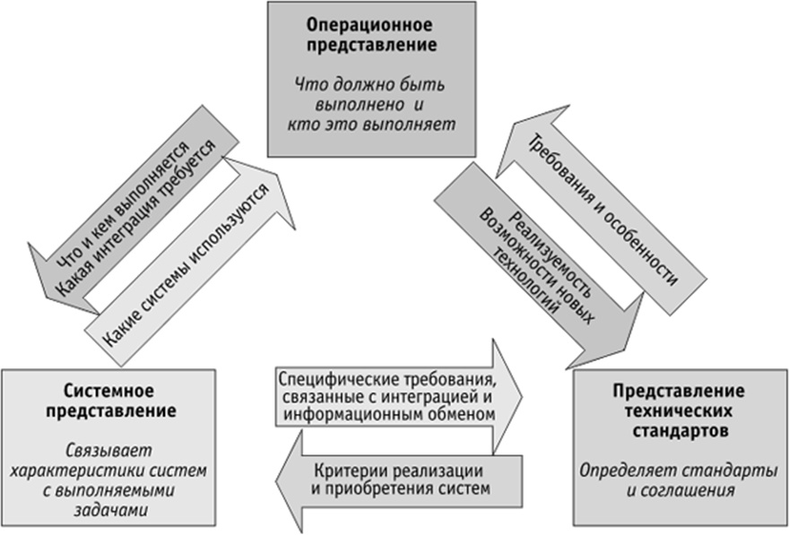

DoDAF состоит из трёх основных элементов: модели (models), виды (views) и точки зрения (viewpoints). Этот набор позволяется отражать взгляды всех заинтересованных сторон. Несмотря на военное назначение, DoDAF является свободно распространяемым. На его базе были сформированы фреймворки НАТО, фреймворк Министерства Обороны Великобритании и множество других.

Главная особенность DoDAF – ориентация на данные, что подразумевает повышенную важность сохранности данных и повторного их использования.

Основным классом систем, которые проектируются при помощи этого фреймворка, являются системы сбора, хранения и анализа данных для поддержки принятия решений (СППР).

DoDAF определяет модели, как шаблоны для сбора данных и подразделяет их на классы:

* таблицы;
* графические изображения структурных аспектов архитектурного решения;
* отображения, определяющие взаимосвязь между типами информации;
* онтологии;
* картинки в свободном формате;
* временные диаграммы.

Виды определяются способами представления для пользователя связанного набора данных. 
К видам данных можно отнести документы, таблицы, графики, диаграммы и т.д. 
Точки зрения представляют собой упорядочен-ное множество видов.

Вторая версия DoDAF содержит восемь точек зрения:

1. **обобщенная** (All Viewpoint): интегрирует все точки зрения для создания архитектурного контекста;
2. **определяющая потенциальные возможности** (Capability Viewpoint): обучение персонала, сроки поставок и т.д.;
3. **определяющая данные и информацию** (Data and Information Viewpoint): определяет способы представления и структуры данных;
4. **операционная** (Operational Viewpoint): рассматривает сценарии работы и активности системы;
5. **проектная** (Project Viewpoint): рассматривает требуемые характеристики и возможности системы;
6. **сервисная** (Service Viewpoint): рассматривает совокупность сервисов;
7. **учитывающая стандарты** (Standards Viewpoint): рассматривает технические стандарты, ограничения, методики, руководства и т.д.;
8. **системная** (System Viewpoint): рассматривает совокупность взаимодействующих систем и их взаимодействие.

DoDAF использует мета-модель данных (DM2), которая является онтологией, составленной из уровней, отражающих особенности представления информации для конкретных групп пользователей. DM2 может быть расширена. 

В ней определены три уровня:

1. **Концептуальная модель данных** (Conceptual Data Model) – описывает архитектуру в технических терминах.
2. **Логическая модель данных** (Logical Data Model) – расширение концептуальной модели путём добавления атрибутов.
3. **Спецификация обмена данными на физическом уровне** (Physical Exchange Specification) – средство, обеспечивающее обмен информации между моделями. 

Существует восемь базовых принципов, руководствуясь которыми, можно успешно применять DoDAF:

1. Архитектурное описание должно быть чётко ориентировано на провозглашённые цели.
2. Архитектурное описание должно быть по возможности простым и понятным, но не упрощённым.
3. Архитектурное описание должно облегчать, а не затруднять процесс принятия решений.
4. Архитектурное описание должно быть составлено таким образом, чтобы его можно было использовать для сравнения различных архитектур.
5. При составлении архитектурного описания должны в максимальной степени использоваться стандартные типы данных, определяемые в DM2.
6. Архитектурное описание должно выполняться в терминах самих данных, а не инструментальных средств работы с данными.
7. Архитектурные данные должны быть организованы в виде, удобном для групповой работы.
8. Архитектурное описание должно быть построено таким образом, чтобы его можно было использовать в сетевой среде.

DoDAF предназначен для составления архитектурного описания системы. Результатом его применения будет являться набор документов, а не информационная система.

___

### 13. Фреймворк FEA.

Архитектура федеральной организации (Federal Enterprise Architecture - FEA) призвана привести множество агентств к единой архитектуре.

Фреймворк FEA можно считать наиболее полной методологией из всех рассматриваемых. Он включает и проработанную таксономию (модель Захмана), и архитектурный процесс (фреймворк TOGAF).

FEA включает набор из пяти эталонных моделей:

1. модель бизнеса;
2. модель обслуживания;
3. модель компонентов;
4. технологическая модель;
5. модель данных.

Полное описание FEA состоит из:

* точки зрения на архитектуры;
* эталонных моделей, описывающих различные точки зрения;
* процесса создания архитектуры;
* процесса перехода от старой архитектуры к новой;
* таксономия для классификации активов;
* методика оценки успешности применения.

В соответствии с FEA, архитектура состоит из сегментов, представляющих главные аспекты бизнеса.

Сегменты бывают двух типов:

* базовый – аспект деятельности в границах политико-административного деления (здоровье является базовым сегментом для Министерства здравоохранения США);

* служебный – сегмент, являющийся фундаментальным, для большинства организаций (управление финансами является служебным сегментом для всех федеральных агентств).

Пять эталонных моделей FEA созданы, чтобы упростить совместную работу и обмен данными в федеральном правительстве:

1. эталонная модель бизнеса (BRM) дает бизнес-представление различных функций федерального правительства.
2. эталонная модель компонентов (CRM) дает ИТ-представление систем, поддерживающих бизнес.
3. техническая эталонная модель (TRM) определяет различные технологии и стандарты, используемые при построении ИТ-систем.
4. эталонная модель данных (DRM) определяет стандартные способы описания данных.
5. эталонная модель производительности (PRM) определяет стандартные способы описания полезности, обеспечиваемой архитектурами предприятий.

Процесс проектирования в FEA сфокусирован на создание архитектуры сегмента для общей архитектуры. 

Процесс разработки архитектуры сегмента состоит из четырёх этапов:

1. Анализ архитектуры: формирование представления сегмента, учитывая план организации.
2. Архитектурное определение: указание требуемого состояния сегмента, документирование показателей производительности, рассмотрение альтернатив и разработка архитектуры предприятия для сегмента (бизнеса, данных, служб, технологической).
3. Стратегия инвестиций и финансирования: анализ способов финансирования проекта.
4. План управления программой и реализация проектов: создание плана управления проектом, его реализации (контрольные точки, показатели производительности).

Уровень соответствия федеральных агентств критериям FEA оценивается по трем категориям:

* завершенность архитектуры — уровень готовности архитектуры;
* использование архитектуры — эффективность использования архитектуры при принятии решений;
* результаты использования архитектуры — преимущества, достигнутые благодаря использованию архитектуры.

___

### 14. Фреймворк Gartner. 

Данная методология архитектуры предприятия была впервые представлена в 2006 г., когда произошло слияние компаний Gartner и Meta. Суть данной методологии состоит в том, что архитектурный процесс представляется как последовательность шагов без четкой детализации самого процесса создания архитектуры предприятия. Констатируется, что в рамках архитектурного процесса компания должна ответить на следующие вопросы:

* Куда движется компания?
* Как достичь поставленных целей?

Методология Gartner представляет собой набор рекомендаций по построению архитектуры предприятия компании.

Согласно Gartner, архитектура представляет собой непрерывный процесс создания, сопровождения и использования инфраструктуры предприятия.

Методология Gartner подразумевает определение четырех взаимосвязанных уровней, среди которых:

1. среда бизнес-взаимодействия (модель взаимодействия между компаниями);
2. стили бизнес-процессов (принципы выполнения основных функций компании);
3. шаблоны (основные модели и алгоритмы программно-аппаратного обеспечения);
4. «строительные блоки» (уровень технологической архитектуры).

Все перечисленные элементы в методологии Gartner связаны с двумя другими слоями архитектуры 
(информационной — данные, приложения, интеграция, доступ и технической — инфраструктура, системное управление, безопасность).

Архитектура предприятия призвана объединить три группы профессионалов: владельцев бизнеса, ИТ-специалистов и специалистов по внедрению технологий. 

Архитектура предприятия должна начинаться с постановки целей, которые организация желает достичь, а не с анализа текущего положения дел.

Gartner рекомендует начать работу с написания рассказа о стратегическом направлении развития организации и бизнес-факторах, на которые необходимо реагировать. 

Рассказ должен быть написан простым языком, без использования аббревиатур, специальной терминологии и технических рассуждений. Рассказ должен быть всем понятен и направлен на формирование у всех единого представления.

После того как в организации будет сформировано единое представление о будущем, можно будет рассмотреть влияние этого представления на архитектуру бизнеса, технологическую архитектуру, информационную архитектуру и архитектуру решений. 

Общее представление о будущем определяет изменения, которые необходимо внести во все перечисленные выше архитектуры, приоритеты этих изменений и привязку этих изменений к ценности бизнеса. 

Архитектура предприятия, согласно представлению Gartner, связана со стратегией, а не с технической реализацией.

**Процесс проектирования архитектуры** в методологии Gartner можно представить в виде следующих этапов:

1. Изложить стратегическое представление о будущем компании на языке бизнеса без упоминания технологий.
2. Составить перечень необходимых к решению задач.
3. Выбрать для реализации задачу из сформированного перечня.
4. Составить список требований к решению выбранной задачи.
5. Сформировать рабочую команду.
6. Разработать целевую архитектуру бизнеса, для выбранной задачи.
7. Создать спецификации будущей системы.
8. Изучить существующую архитектуру и определить, какие изменения необходимо внести.
9. Разработают технологическую архитектуру для ИТ-систем, которые будут поддерживать новую архитектуру бизнеса.
10. Изучить существующие архитектуры на предмет возможности повторного использования имеющихся технологических активов.

Подход компании Gartner заключается в создании высокоуровневой архитектуры, ориентированной на бизнес; детали рассматриваются только тогда, когда это необходимо. 

Роль методологии Gartner заключается не в создании архитектуры предприятия, а в создании процесса, позволяющего развивать архитектуру предприятия в соответствии с бизнес-стратегией.

___

### 15. Архитектура Web-приложений (Web-сервисов).

Передачу с сервера на рабочую станцию объектов по запросам, поступающим от навигатора, обеспечивает функционирующая на сервере программа, называемая Web-сервисом.

Web-сервис – приложение, доступное через Internet и предоставляющее некоторые услуги, форма которых не зависит от поставщика (т.к. используется универсальный формат данных - XML).

В основе Web-сервисов лежат открытые стандарты и протоколы:

* SOAP
* UDDI
* WSDL

___

### 16. Открытые стандарты и протоколы, лежащие в основе Web-сервисов.

**SOAP** – разработан консорциумом всемирной паутины WЗС, определяет формат запросов к Web-сервисам. Сообщения между Web-сервисом и его пользователем пакуется в SOAP-конверты (XML-конверты).

**UDDI** – протокол поиска Web-сервисов в Интернет. Это бизнес-реестр, в  котором провайдеры Web-сервисов регистрируют службы, а разработчики находят необходимые сервисы для включения в свои приложения.

**WSDL**. Интерфейс Web-сервиса описывается в WSDL-документах (подмножество XML). Перед развёртыванием службы разработчик составляет её описание на языке WSDL- языка описания Web-сервисов, указывает адрес Web-сервиса, поддерживаемы протоколы, перечень допустимых операций, форматы запросов и ответов.

### 17. Технологии, поддерживающие концепцию распределённых объектных систем. EJB.

Основная идея, лежащая в разработке технологии EJB – создать такую инфраструктуру для компонентов, что бы они могли бы легко «вставляться» и удаляться из серверов, тем самым повышая или снижая функциональность сервера.

Эта технология создаёт новый компонент из уже существующих, готовых и настроенных.
EJB-спецификация определяет следующие цели:

1. Облегчить разработчикам создание приложений, избавив их от необходимости реализовывать такие сервисы, как транзакции, загрузки, хранение данных, безопасность приложения и другие. 
2. Описать основные структуры EJB-системы, описав при этом интерфейсы взаимодействия между её компонентами.
3. EJB преследует цель стать стандартом для разработки клиент-серверных приложений на Java. 
4. Серверные компоненты EJB от различных производителей могут быть использованы вместе, они должны работать на любом EJB-совместимом сервере даже без перекомпиляции.
5. EJB совместима с Java API, может взаимодействовать и с другими приложениями.
6. Разработчику не нужно самому реализовывать EJB-объект. Этот класс создаётся специальным кодогенератором, поставляемым вместе с EJB-контейнером. EJB-объект (созданный с помощью сервисов контейнера) и EJB-компонента (созданная разработчиком) реализуют один и тот же интерфейс.

Когда приложение-клиент хочет вызвать метод у EJB-компоненты, то сначала вызывается аналогичный (по имени) метод у EJB-объекта, что находится на стороне клиента, а тот в свою очередь, связывается с удалённой EJB-компонентой и вызывает у неё этот метод (с теми же аргументами).

Достоинства EJB:

* быстрое и простое создание;
* Java-оптимизация;
* динамическая загрузка компонент-переходников (когда заранее не знаем сколько их будет);
* возможность передачи объектов по назначению;
* встроенная безопасность.
КОМПОНЕНТЫ EJB:
* Сервер приложений является одним из главных компонентов EJB
и предоставляет остальным компонентам соответствующую среду: права доступа, сервис именования компонентов, выполняет функции координатора транзакций и контейнера, в котором хранятся компоненты EJB. 
* Внутри сервера приложений работает 4 службы ( 1-находит компоненты, 2- предоставляет услуги транзакций, т.е. методы, изменяющие состояние компонентов, 3- обеспечивает ограничение удалённого доступа к компонентам EJB, 4- обеспечивает доставку и хранение очередей сообщений) и контейнер (предоставляет среду, в которой могут функционировать компоненты EJB. 

___

### 18. Технологии, поддерживающие концепцию распределённых объектных систем. DCOM.

Программная архитектура, разработанная компанией Microsoft для распределения приложений между несколькими компьютерами в сети. 

Программный компонент на одной из машин может использовать технологию DCOM для передачи сообщения (его называют удалённым вызовом процедуры) к компоненту другой машины.

DCOM автоматически устанавливает соединение, передаёт сообщение и возвращает ответ удалённого компонента.

Для того, что бы различные фрагменты сложного приложения могли работать вместе через Интернет, необходимо обеспечить между ними надёжные и защищённые соединения, а так же создать специальную систему, которая направляет программный трафик.

Большая часть реальных распределенных приложений имеют один или более критический компонент, который участвует в большинстве операций. Это могут быть, например, компоненты БД, доступ к которым должен осуществляться постоянно. 

Компоненты такого типа не могут дублироваться, поскольку их предназначение заключается в организации единственной точки синхронизации среди всех пользователей приложения. Для увеличения быстродействия распределенного приложения в целом такие компоненты, создающие «узкие места», должны перераспределяться на специально выделенный мощный сервер.

DCOM помогает выявить такие критические компоненты на ранних этапах проектирования. Технология DCOM позволяет первоначально разместить все компоненты на одной машине, а затем перенести критические компоненты на отдельные машины.

Технология программирования DCOM облегчает схемы перераспределения по мере разрастания приложения. Первоначально машина сервера может содержать все компоненты. По мере увеличения потребностей можно добавить другие машины с перераспределением компонентов на эти машины без всякого изменения кода. 

Таким образом, технология DCOM характеризует такое свойство COM технологий, как масштабируемость.

При реализации COM технологии, в зависимости от местоположения клиента и сервера возможны три варианта:

* Во-первых, клиент и сервер располагаются на одной машине и запускаются в одном процессе. 
* Во-вторых, клиент и сервер располагаются на одной машине, но запускаются в разных процессах (например, таблицы Excel вставлены в документ Word). В этом случае, сервер представляет собой программу;
* В-третьих, клиент и сервер располагаются на разных машинах. В данном случае используется распределенный вариант COM, т.е. DCOM

Способность DCOM связывать компоненты позволила Microsoft наделить Windows рядом важных дополнительных возможностей, в частности, реализовать сервер, отвечающий за выполнение транзакций баз данных через Интернет.

Но как только в системе возникает необходимость работать с архитектурой, отличной от Windows, DCOM перестаёт быть оптимальным решением проблемы.

Недостатки:

* Ориентация на системы Microsoft, зависимость от платформы
* Архитектура предусматривает использование для поиска компонентов в сети сетевой службы каталогов, которая появилась в версии Windows2000. В более ранних версиях DCOM должна использовать локальные списки компонентов, что совершенно не приемлемо для приложений большого масштаба. 
* Сложность реализации
* Нет проверки безопасности

Достоинства: 

* Независимость от языка
* Динамическое нахождение объектов (заранее не знаем сколько их будет)
* Динамический/статистический вызов (вызов метода, о котором пока ничего не известно)
* Маcштабируемость
* Множественность Windows-программистов

### 19. Технологии, поддерживающие концепцию распределённых объектных систем. CORBA.

Технология CORBA создана для поддержки разработки и развёртывания сложных объектно-ориентированных прикладных систем. 

CORBA является механизмом в программном обеспечении для осуществления интеграции изолированных систем, который даёт возможность программам, написанным на разных языках программирования, работающим в разных узлах сети, взаимодействовать друг с другом так же просто, как если бы они находились в адресном пространстве одного процесса. 
Определяет механизмы взаимодействия объектов в разнородной сети.

Она позволяет рассматривать все приложения в распределённой системе как объекты. Причём объекты могут одновременно играть роль и клиента и сервера. Роль клиента, если объект является инициатором вызова метода у другого объекта; роль сервера, если другой объект вызывает на нём какой-нибудь метод.

Большинство объектов одновременно используют роль и клиентов, и серверов, попеременно вызывая методы на других объектах и отвечая на вызовы извне. 
Объекты-серверы называются «реализацией объектов».

Использование CORBA позволяет строить гораздо более гибкие системы, чем системы «клиент-сервер», основанные на двухуровневой и трёхуровневой архитектурах. 

Достоинства:

* Платформенная независимость
* Языковая независимость
* Динамические вызовы
* Масштабируемость
* Широкая индустриальная поддержка
* Динамическое обнаружение объектов

___

### 20. Информационная система корпорации (КИС). Состав, базовые модели.

Информационная система корпорации (КИС) состоит из двух относительно независимых составляющих.

Первая представляет собой собственно компьютерную инфраструктуру корпорации (сетевая, телекоммуникационная, программная, информационная, организационная инфраструктура) и отражает системно-техническую структурную сторону любой ИС.

Вторая составляющая – взаимосвязанные функциональные подсистемы, обеспечивающие решение задач корпорации и достижение ее целей и относится к прикладной области и сильно зависит от специфики задач корпорации и ее целей.

Базовые модели КИС:

* **MRP** (Material Requirement Planning) – планирование потребностей в материалах и ресурсах.
* **ERP** (Enterprise Resource Planning) – система планирования ресурсов организации. Цель ERP - управлять всеми ресурсами предприятия. 
* **CSRP** (Customer Synchronized Resource Planning) – планирование ресурсов организации, синхронизированное на потребителя.

В состав КИС должны входить программные продукты, по крайней мере трех классов:

* комплексные системы управления предприятием (автоматизированные информационные системы поддержки принятия управленческих решений);
* системы электронного документооборота;
* продукты, позволяющие создавать модели функционирования организации, проводить анализ и оптимизацию ее деятельности. Сюда же можно отнести системы класса АСУТП и САПР, продукты интеллектуального анализа данных.

___

### 21. Объектно-ориентированная модель предприятия.

При создании корпоративных систем в качестве основы для описания проектных решений настройки предлагается использовать объектно-ориентированную модель предприятия.

Основу такой модели составляет спецификация классов предметной области. Именно в понятиях этой модели требуется описать модель конкретного предприятия.

Преимущества объектно-ориентированного подхода к проектированию ИС: 

Поскольку данные по сравнению с процессами являются более стабильной и относительно редко изменяющейся частью системы, применение объектно- ориентированного подхода к проектированию позволяет сделать системы более открытыми и легче поддающимися внесению изменений. Это дает возможность постепенного развития системы и не приводит к полной ее переработке даже в случае существенных изменений требований. 

Объектная декомпозиция позволяет создавать модели меньшего размера путем использования общих механизмов, обеспечивающих необходимую экономию выразительных средств.

Использование объектно-ориентированного подхода существенно повышает уровень унификации разработки и пригодность для повторного использования не только программного обеспечения, но и проектов, что, в конце концов, ведет к сборочному созданию ИС.

Объектная декомпозиция уменьшает риск создания сложных ИС, поскольку она предполагает эволюционный путь развития системы на базе относительно небольших подсистем. 

Процесс интеграции системы растягивается на все время разработки, а не превращается в единовременное событие. 

Основные недостатки объектно-ориентированного подхода: 

1. Не позволяет оценить степень соответствия разработанной модели ИСУ стратегическим целям развития предприятия. 
2. Модели, разработанный с помощью нотаций, поддерживающих данный подход, менее понятны людям, не являющимся специалистами в области ИТ.
3. ИС, разработанные на основе объектно-ориентированного подхода, несколько теряют в производительности. Однако этот фактор в связи с ростом производительности вычислительной техники фактически потерял актуальность.

___

### 22. Основные абстрактные модели для моделирования в инструментальной подсистеме.

В качестве основных для моделирования в инструментальной подсистеме рассмотрим следующие абстрактные модели:

* Статическая модель объектного представления предметной области;
Модель называется статической когда входные и выходные воздействия постоянны во времени.

 Статическая модель отражает строение и параметры объекта , поэтому ее называет структурной

 Построение статической модели предметной области - это структурное представление информационные аспектов системы.

* Организационно-функциональная модель предприятия (ОФМ) – это документ, описывающий организационную структуру (с определенной детализацией) и функции, выполняемые подразделениями предприятия. 

* Модель деталей операций – это отображение процессов функционирования управляемой системы в рамках поведения операции. В зависимости от исследуемой операции будет изменяться и модель.

* Модель функциональных семантических сетей; семантическая сеть – это ориентированный граф, вершинами которого сопоставляются объекты (понятия, события, процессы и т д), а дугам – отношения между объектами. Построение сети способствует осмыслению инф-ии и знаний, поскольку позволяет установить противоречивые ситуации, недостаточность имеющейся инф-ии.
 
* Модель состояний отображает динамику состояния объектов системы и их поведения. Она выражает описание ЖЦ объекта, его поведения. На основе этих моделей представляются события и действия;

* Модель коопераций;

___

### 23. Каркасы проектирования.

Каркас – набор взаимодействующих классов, составляющих повторно используемый дизайн для конкретного класса программ. Каркас диктует определенную структуру приложения. В каркасе аккумулированы проектные решения, общие для данной предметной области. Акцент на повторное использование дизайна, а не кода. 

При работе с каркасом повторно используют тело и пишут код, который оно вызывает. В результате приложение создается быстрее.

С помощью каркасов объектно-ориентированные системы можно использовать повторно в максимальной степени. Крупные объектно-ориентированные приложения составляются из слоев, взаимодействующих друг с другом каркасов.

Дизайн и код приложения в значительной мере определяются каркасами, которые применялись при его создании.

Каркасы воплощают теорию проблемных доменов(областей) и всегда являются результатом анализа этих доменов.

Каркас может быть адресован всей архитектуре приложения или только ее части.
Для подгонки архитектурных вариаций и обеспечения настраиваемости реализаций часто применяется параметризация.

Могут также применяться и другие механизмы расширения: наследование классов и интерфейсов, переопределение методов и делегирование.

Эти механизмы составляют точки изменчивости каркаса.

___

### 24. Различия между паттернами и каркасами.

* Паттерны проектирования более абстрактны, чем каркасы. В код могут быть включены целые каркасы, но только экземпляры паттернов. Каркасы можно писать на разных языках программирования и не только изучать, но и непосредственно исполнять и повторно использовать. В противоположность этому паттерны проектирования необходимо реализовывать всякий раз, когда в них возникает необходимость. Паттерны объясняют
намерения проектировщика, компромиссы и последствия выбранного дизайна. 

* Как архитектурные элементы паттерны проектирования мельче, чем каркасы. Типичный каркас содержит несколько паттернов. Обратное утверждение неверно.

* Паттерны проектирования менее специализированы, чем каркасы. Каркас всегда создается для конкретной предметной области. В принципе каркас графического редактора можно использовать для моделирования работы фабрики, но его никогда не спутаешь с каркасом, предназначенным специально для моделирования. Напротив, паттерны разрешается использовать в приложениях почти любого вида.

___

### 25. Слои каркасов, обеспечивающих описание и реализацию проектных решений КИС в терминах базовых метамоделей предметной области.

* Мета-модель позволяет описать конкретные модели, используемые при проектировании ИС. Каркас описания метамоделей обеспечивает разработку и сопровождение базовых моделей, используемых при проектировании ИС.

* Проектные решения описываются в соответствии с правилами выбранных мета-моделей языков спецификаций. Компоненты каркаса работы с базовыми моделями предоставляют необходимые сервисы для фиксации и исполнения проектных решений.

* Базовые модели бизнеса описываются в терминах выбранных языков спецификаций. Каждая такая модель должна иметь необходимый набор точек расширения для конкретизации модели конкретного бизнеса.

* Модель конкретного бизнеса отражает результаты конкретного проекта внедрения приложения.

___

### 26. Варианты моделей спецификации.

**Текстовое представление на специализированном языке**

Разработка специализированного языка для описания проектных решений для проблемного домена является сложным и дорогостоящим решением. Однако наличие соответствующих каркасов позволит не отвлекаться в спецификации на ключевые решения, принятые при реализации каркаса, а сосредоточиться на проблемах использования сервисов каркаса и конкретизации его точек расширения средствами специализированного языка.

При этом компоненты высокоуровневой модели каркасов должны быть явно вплетены в синтаксис и семантику соответствующего языка.

Вопрос о внутреннем хранении спецификации требуется решать отдельно.

**Графическое представление**

Графическое представление высокоуровневых спецификаций (например, на языке UML) обладает рядом преимуществ по сравнению со специализированными доменными языками. Прежде всего, спецификация используемых каркасов представляется в наглядной и понятной форме. Большинство точек расширения связано с конкретизацией абстрактных классов каркаса.

Поэтому конкретизация в большинстве случаев также может быть выражена графическими средствами в контексте абстрактной спецификации каркаса.

Вопрос о внутреннем хранении спецификаций может быть решен с использованием XML-форматов. UML-спецификация может быть трансформирована в XML-спецификацию.

**XML-Представление**

Язык спецификации структур XML является универсальным средством для описания любых структурных моделей.

Инструменты, поддерживающих работу с XML-спецификациями, достаточно развиты и представляют все необходимые возможности манипулирования и исполнения высокоуровневых спецификаций.

Для эффективного использования спецификации каркасов должны быть описаны средствами XML, что обеспечит их правильное использование при конкретизации проектных решений.
XML-представление можно трансформировать в ER-представление, и наоборот.

**Реляционное представление.**

Реляционное представление – универсальна как для спецификации разнообразных информационных структур (метаданных), так и для ведения конкретных данных в соответствии с этими метаданными.

Реляционная модель поддержана развитыми средствами спецификации и доступа к данным. Особо следует отметить высокое качество поддержки целостности данных, обеспечиваемое всеми производителями реляционных СУБД.

___

### 27. Иерархическая структура каркасов для решения задач управления ЖЦИ. 

На примере проблемного домена информационной поддержки жизненного цикла изделия (ЖЦИ):

* Разработка высокоуровневых каркасов, поддерживающих метамодели проектирования ИС управления жизненным циклом изделий (ЖЦИ).
* Выделение проблемных домен, покрывающих область ЖЦИ.
* Разработка системы взаимосвязанных каркасов, реализующих выделенные проблемные домены.
* Разработка инструментов работы с точками расширения каркасов.

___

### 28. Пятиуровневая архитектура приложения КИС.

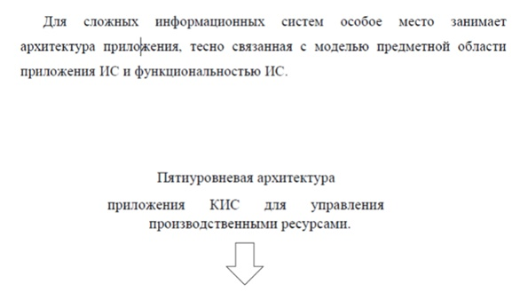
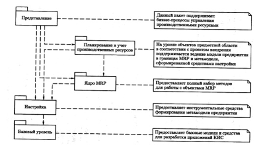
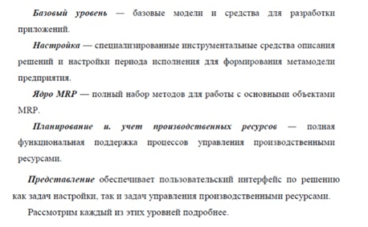
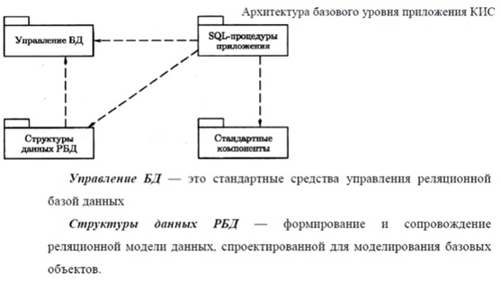
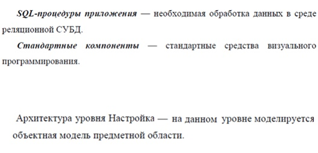
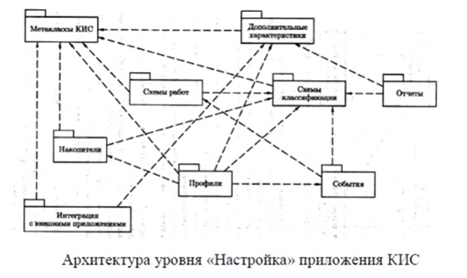
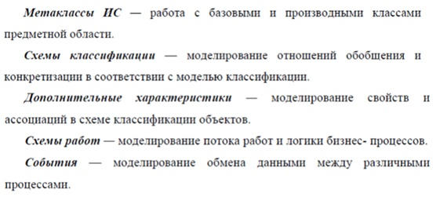
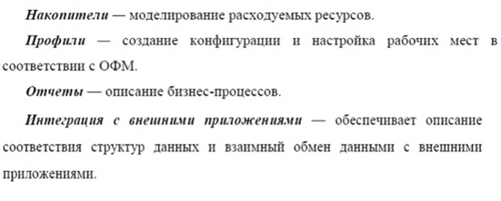
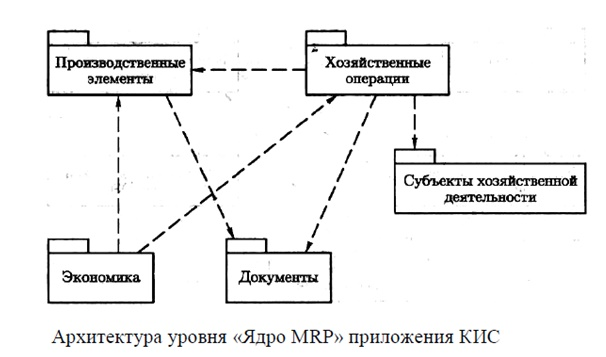

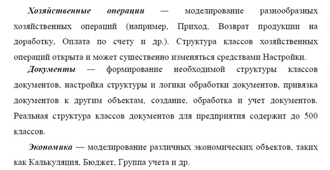
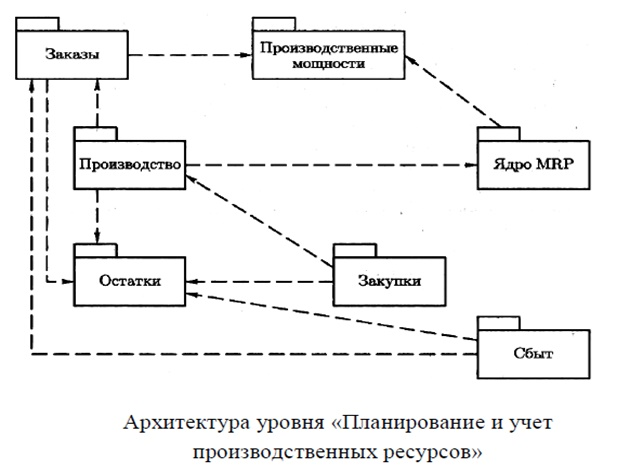
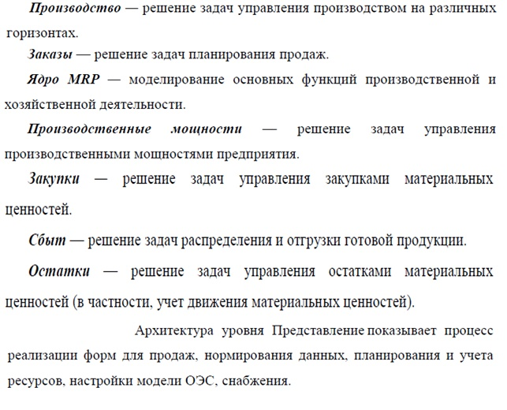
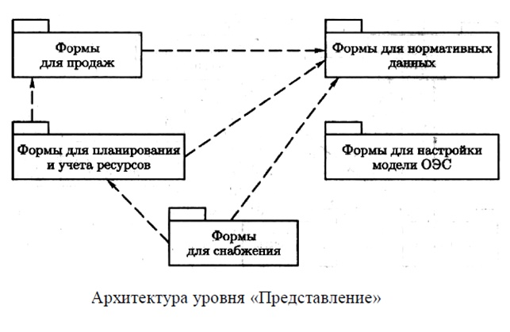

___

### 29. Сервисно-ориентированная архитектура (SOA).

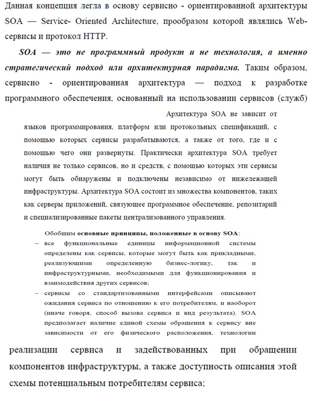
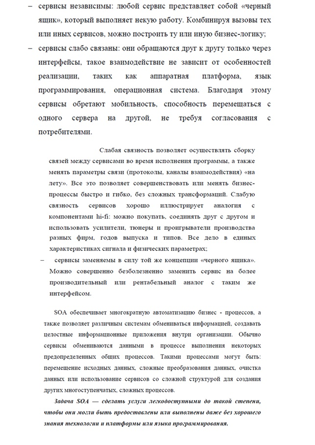
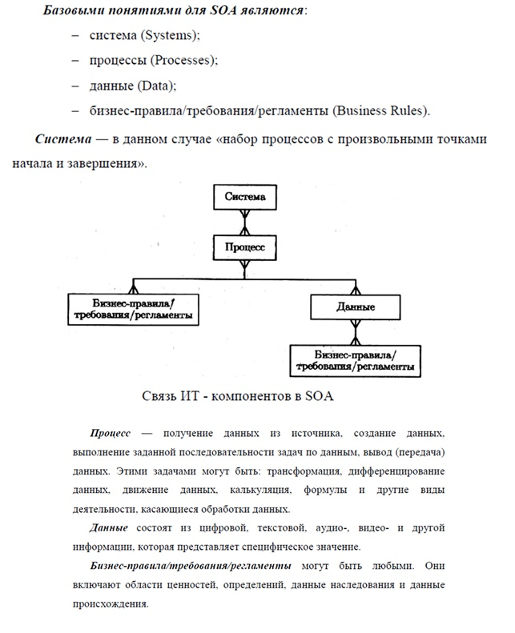

___

### 30. Основополагающие условия для моделирования SOA. Преимущества внедрения архитектуры SOA.

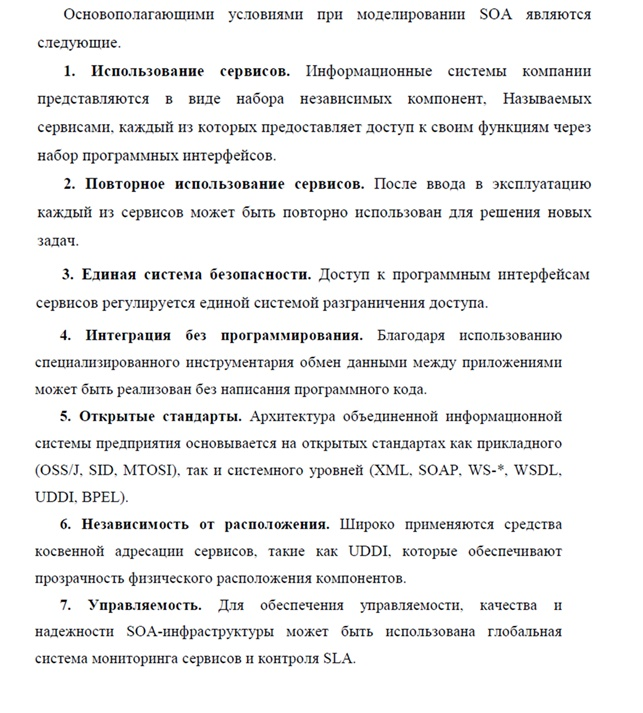
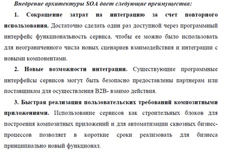
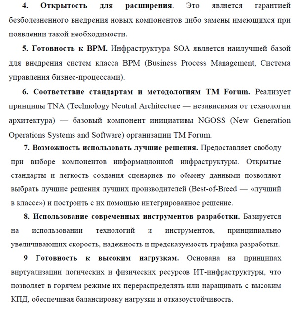

___